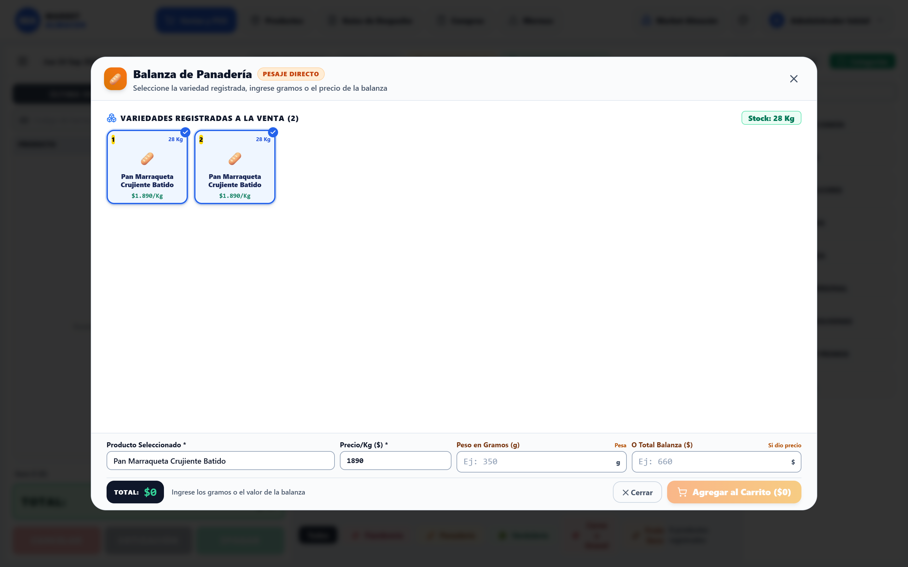
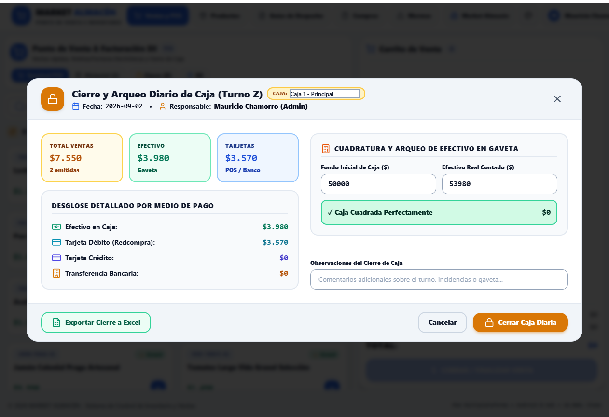
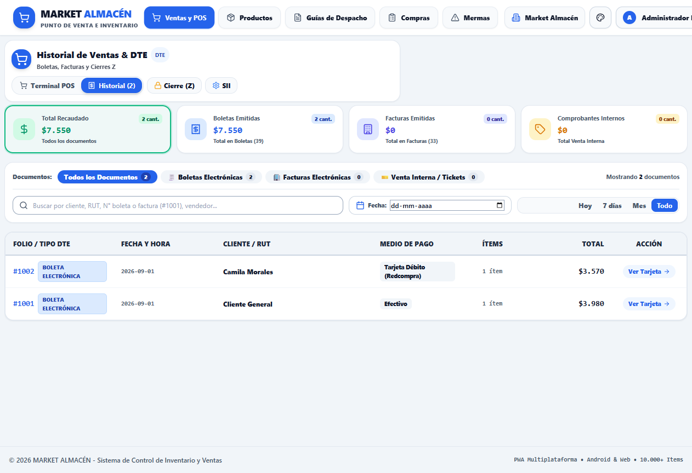
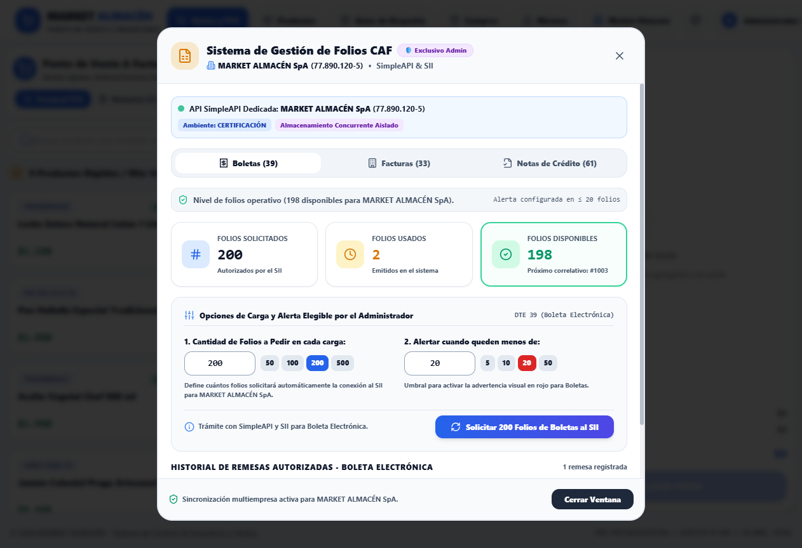
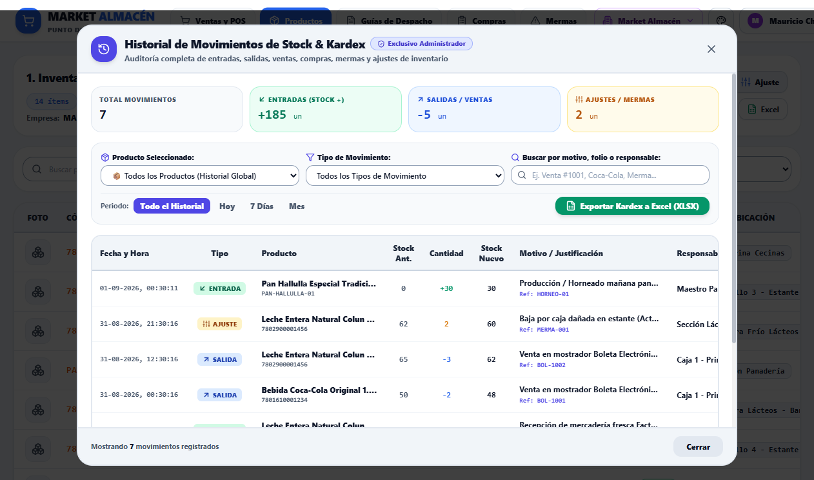

# ⚡ GUÍA RÁPIDA DE OPERACIÓN & RESUMEN EJECUTIVO
## **MARKET ALMACÉN — Guía de Bolsillo para Cajeros y Administradores**
*Edición 2026 — Procedimientos Esenciales y Protocolos de Mostrador*

> 📥 **Descarga en PDF Disponible:** Puede descargar esta guía de bolsillo en PDF abriendo [`GUIA_RAPIDA_RESUMEN_MARKET_ALMACEN.pdf`](./GUIA_RAPIDA_RESUMEN_MARKET_ALMACEN.pdf) o la versión web [`GUIA_RAPIDA_RESUMEN_MARKET_ALMACEN.html`](./GUIA_RAPIDA_RESUMEN_MARKET_ALMACEN.html).

---

### 1. Flujo Diario de Apertura y Venta Express (POS)
Guía rápida de atención en mostrador para cajeros y vendedores:

* **Iniciar Turno:** Inicie sesión con su usuario y contraseña asignada.
* **Venta con Teclas Rápidas:** Toque los productos de la botonera de 9 favoritos o escanee con lector de código de barras.
* **Venta al Peso:** Pulse '[Venta por Peso / Granel]', elija el preset de gramos (250g, 500g, 1kg) o digite el peso de la balanza.
* **Anotar Cantidad Solicitada:** En el carrito, pulse el número de cantidad de cualquier ítem y digite directamente la cantidad requerida.
* **Doble Precio en Liquidación:** Si el producto está en oferta acotada, seleccione en pantalla si cobrar 'Precio Liquidación' o 'Precio Normal'.
* **Cobro y Vuelto:** Presione '[COBRAR / FINALIZAR VENTA]', seleccione Boleta (39) o Factura (33) y verifique el cálculo automático de vuelto.

*Figura R.1: Operación básica del Terminal Punto de Venta (POS) para atención rápida.*

---

### 2. Cierre de Caja (Z) y Arqueo por Turno
Conciliación de dinero físico en caja al terminar el turno:

* En el menú POS, presione el botón superior **`[ Cierre (Z) ]`**.
* Revise el consolidado de ventas: Efectivo recaudado, Débito (Redcompra), Crédito y Transferencias.
* Imprima el Comprobante de Cierre Z térmico para el sobre de recaudación del administrador.

*Figura R.2: Comprobante de Cierre Z Multicaja y conciliación de valores.*

---

### 3. Historial de Ventas y Botones de Métricas
Auditoría interactiva de documentos emitidos:

* **4 Botones Superiores de Métricas:** Pulse *Total Recaudado*, *Boletas Emitidas*, *Facturas Emitidas* o *Venta Interna* para ver cantidad total y monto $ recaudado.
* **Buscador Tipo Calendario:** Filtre rápidamente por rango de fechas o busque por RUT o N° de Folio.
* **Tarjeta de Detalle:** Haga clic sobre cualquier fila para abrir la tarjeta de venta, reimprimir ticket, enviar por correo o anular.

*Figura R.3: Historial interactivo con métricas dinámicas y listado vertical.*

---

### 4. Gestión de Folios CAF ante el SII (Exclusivo Admin)
Solicitud y control de bolsas de folios tributarios por empresa:

* Haga clic en su nombre de usuario en la barra superior y seleccione **`[ 📑 Sistema de Folios CAF ]`**.
* Verifique el estado: Folios Solicitados, Usados y Disponibles en tiempo real.
* Elija el tipo de comprobante: Boletas (39), Facturas (33) o Notas de Crédito (61).
* Seleccione la cantidad a pedir (50, 100, 200 o 500) y presione **`[ 🔄 Solicitar Folios al SII ]`**.
* Recibirá la confirmación automática: *✅ Folios del [desde] al [hasta] cargados y autorizados con éxito*.

*Figura R.4: Sistema de Gestión y Carga de Folios CAF independiente por empresa.*

---

### 5. Historial de Movimientos de Inventario (Kardex)
Trazabilidad de stock y exportación a Excel para el Administrador:

* En el menú de Productos, abra la ficha de cualquier producto o presione el botón superior **`[ 📊 Historial Kardex ]`**.
* Consulte todos los ingresos por compra, salidas por venta, mermas o ajustes manuales.
* Presione el botón verde **`[ 📥 Exportar a Excel ]`** para descargar la auditoría completa.

*Figura R.5: Historial Kardex de movimientos de inventario y exportación a Excel.*

---
