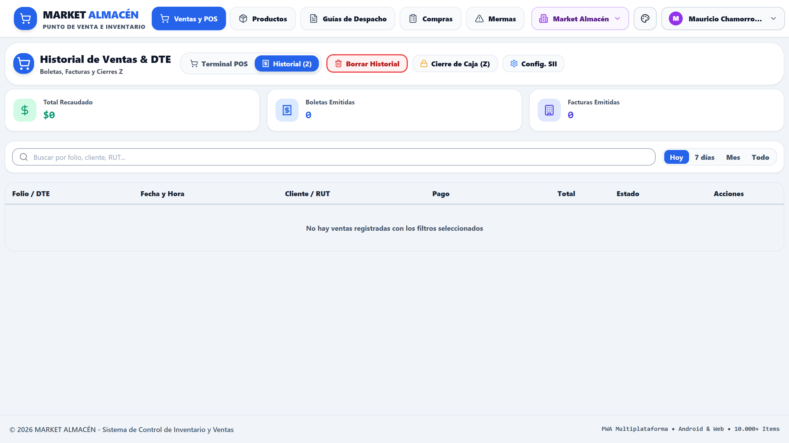
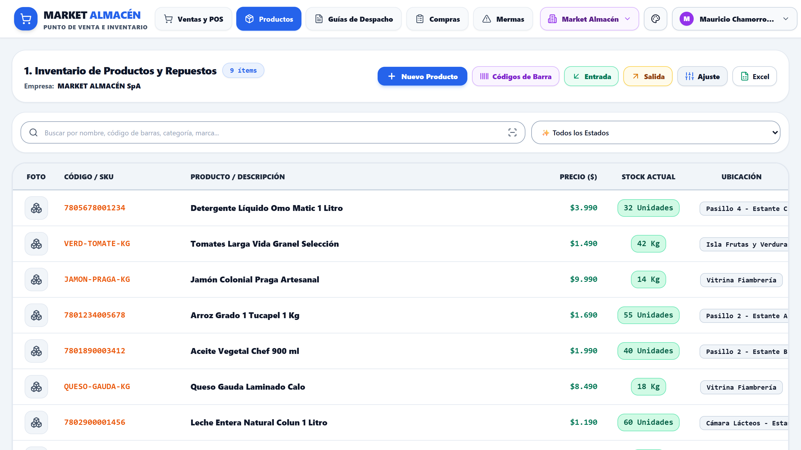
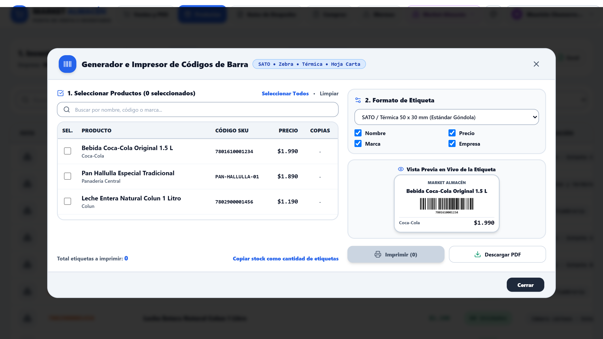
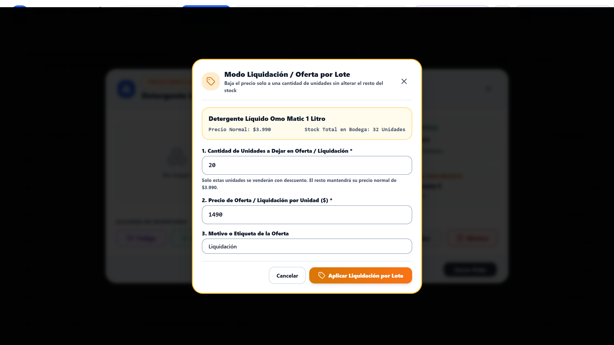
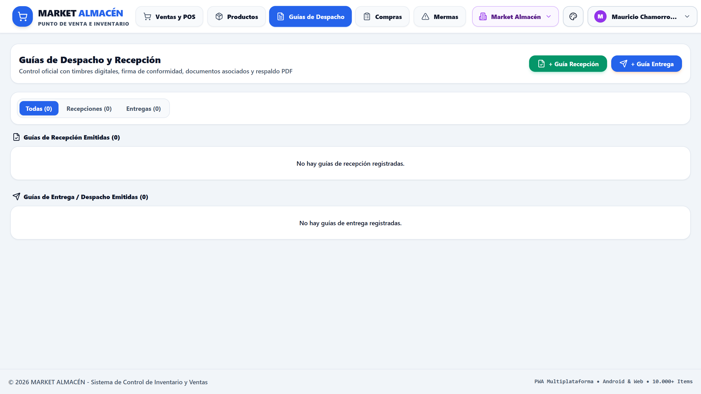
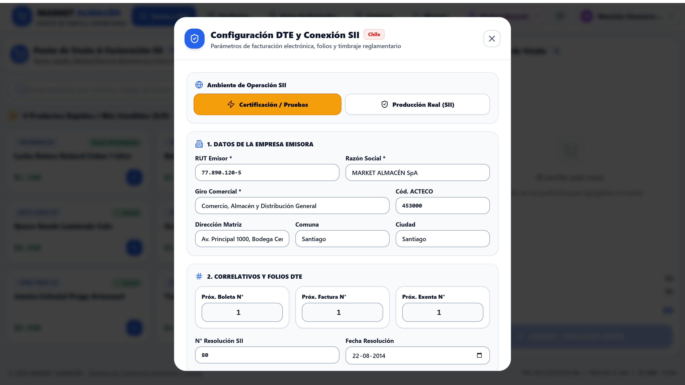
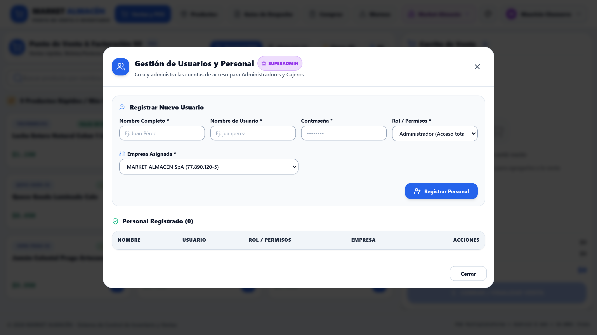

# 📖 MANUAL OFICIAL DE USUARIO & GUÍA OPERATIVA ILUSTRADA
## **MARKET ALMACÉN — Sistema Integral de Control de Inventario, POS y Facturación SII**
*Edición Oficial 2026 — Manual de Capacitación para Clientes y Usuarios Finales*

---

## 📑 ÍNDICE GENERAL DEL LIBRO

1. [Capítulo 1: Introducción y Arquitectura del Sistema](#capítulo-1-introducción-y-arquitectura-del-sistema)
2. [Capítulo 2: Inicio de Sesión y Perfiles de Usuario](#capítulo-2-inicio-de-sesión-y-perfiles-de-usuario)
3. [Capítulo 3: Terminal Punto de Venta (POS) y Cobro Rápido](#capítulo-3-terminal-punto-de-venta-pos-y-cobro-rápido)
4. [Capítulo 4: Venta por Peso y Granel (Balanza Digital)](#capítulo-4-venta-por-peso-y-granel-balanza-digital)
5. [Capítulo 5: Checkout, Métodos de Pago y Facturación SII](#capítulo-5-checkout-métodos-de-pago-y-facturación-sii)
6. [Capítulo 6: Historial de Ventas, DTE y Anulaciones](#capítulo-6-historial-de-ventas-dte-y-anulaciones)
7. [Capítulo 7: Gestión Integral de Inventario y Ficha de Producto](#capítulo-7-gestión-integral-de-inventario-y-ficha-de-producto)
8. [Capítulo 8: 🏷️ Modo Liquidación / Ofertas por Lote de Unidades](#capítulo-8-️-modo-liquidación--ofertas-por-lote-de-unidades)
9. [Capítulo 9: Guías de Despacho y Recepción de Mercadería](#capítulo-9-guías-de-despacho-y-recepción-de-mercadería)
10. [Capítulo 10: Compras a Proveedores y Control de Mermas](#capítulo-10-compras-a-proveedores-y-control-de-mermas)
11. [Capítulo 11: Configuración de Empresa, Parámetros SII y Usuarios](#capítulo-11-configuración-de-empresa-parámetros-sii-y-usuarios)
12. [Capítulo 12: Guía de Instalación en Android (APK) y Acceso Web para Clientes](#capítulo-12-guía-de-instalación-en-android-apk-y-acceso-web-para-clientes)

---

## CAPÍTULO 1: INTRODUCCIÓN Y ARQUITECTURA DEL SISTEMA

### 1.1 ¿Qué es Market Almacén?
**Market Almacén** es un software de punto de venta (POS) y gestión de bodega de última generación, concebido para optimizar la velocidad de atención al cliente, mantener un control exacto de existencias y emitir documentos tributarios electrónicos (DTE) con cumplimiento de la normativa del Servicio de Impuestos Internos (SII).

### 1.2 Arquitectura Híbrida Offline-First
* **Operación Continua sin Internet**: La base de datos opera localmente en su dispositivo mediante IndexedDB. Si se corta el suministro de internet, su caja sigue cobrando, pesando productos y emitiendo comprobantes.
* **Sincronización en la Nube**: Al restablecerse la conexión, la aplicación envía los registros a la nube en segundo plano para respaldo permanente.

---

## CAPÍTULO 2: INICIO DE SESIÓN Y PERFILES DE USUARIO

### 2.1 Acceso al Sistema
Al abrir la aplicación se presenta la pantalla de autenticación protegida. Cada trabajador ingresa con su nombre de usuario y contraseña asignada.

### 2.2 Perfiles Disponibles:
1. **👑 Administrador**: Dueño o encargado general. Posee acceso total a configuración de precios, inventario, reportes, compras, mermas, guías, personal y parámetros del SII.
2. **🛒 Ventas (Cajero)**: Personal de atención al público. Acceso enfocado al Terminal POS para pistolear artículos, pesar en balanza, cobrar, emitir boletas/facturas y realizar el Cierre de Caja (Corte Z).

| Módulo / Función | Administrador | Ventas (Cajero) |
| :--- | :---: | :---: |
| **Terminal POS y Balanza** | ✅ Permitido | ✅ Permitido |
| **Cobro y Boletas/Facturas** | ✅ Permitido | ✅ Permitido |
| **Cierre de Caja (Corte Z)** | ✅ Permitido | ✅ Permitido |
| **Ver Historial e Imprimir PDF** | ✅ Permitido | ✅ Permitido |
| **Anulación de Ventas / Devoluciones** | ✅ Permitido | ❌ Restringido |
| **Crear y Modificar Inventario** | ✅ Permitido | ❌ Restringido |
| **Activar Liquidación por Lote** | ✅ Permitido | ❌ Restringido |
| **Emisión y Recepción de Guías** | ✅ Permitido | ❌ Restringido |
| **Compras a Proveedores y Mermas** | ✅ Permitido | ❌ Restringido |
| **Gestión de Personal y Claves** | ✅ Permitido | ❌ Restringido |

---

## CAPÍTULO 3: TERMINAL PUNTO DE VENTA (POS) Y COBRO RÁPIDO

### 3.1 Estructura Ergonómica sin Scroll
La pantalla de venta está organizada para que el cajero tenga todo a la vista sin necesidad de desplazarse verticalmente:
1. **Barra de Búsqueda Superior**: Permite pistolear con lector láser o tipear nombres de productos.
2. **Botonera de 9 Favoritos**: Muestra los artículos de mayor rotación listos para vender con un solo toque.
3. **Cuadrícula de Productos Rápidos**: Tarjetas con código, stock actual, precio unitario y botón (+).
4. **Panel Lateral de Carrito**: Lista en tiempo real de los ítems agregados, desglose de Neto, 19% IVA y botón destacado de COBRAR.

### 3.2 Búsqueda y Venta Directa
* **Pistoleo**: Al leer el código de barras de un producto, este se añade automáticamente al carrito.
* **Búsqueda por Texto**: Escriba parte del nombre (ej: *"arroz"*, *"leche"*) para filtrar la cuadrícula al instante.

### 3.3 Configuración de los 9 Favoritos
Haga clic en **`[⚙️ Configurar 9 Favoritos]`** para elegir hasta 9 productos de alta demanda. Estos quedarán fijados de forma permanente en la cabecera del POS.

---

## CAPÍTULO 4: VENTA POR PESO Y GRANEL (BALANZA DIGITAL)

### 4.1 Proceso Paso a Paso para Venta Fraccionada
1. Presione el botón **`[⚖️ Venta por Peso / Granel]`** o el botón `(+)` de cualquier producto por kilo.
2. **1. Categoría de Producto a Pesar**: Seleccione la familia (*Cecinas, Quesos, Panadería, Verduras, Papas, Tomates, Frutas, Carnes, Frutos Secos o Legumbres*).
3. **2. Variedad en Stock Inventariado**: El sistema muestra las opciones disponibles con su stock en bodega. La variedad elegida se resalta en color azul.
4. **3. Ingreso del Peso**: Ingrese los **Kilos (Kg)** (ej: `0.350`) o los **Gramos (g)** (ej: `350`). Ambas casillas se sincronizan automáticamente y calculan el total a cobrar.
5. Presione **`Agregar al Carrito`** para transferir el ítem a la venta en curso.

---

## CAPÍTULO 5: CHECKOUT, MÉTODOS DE PAGO Y FACTURACIÓN SII

### 5.1 Selección de Documento Tributario (DTE)
* **Boleta Electrónica**: Documento emitido para consumidor final con cálculo automático de IVA.
* **Factura Electrónica**: Requiere completar el RUT, Razón Social, Giro Comercial, Dirección y Comuna del cliente.
* **Comprobante Interno**: Para ventas internas sin timbraje fiscal.

### 5.2 Registro del Pago y Vuelto
* **Efectivo**: Ingrese el monto con el que paga el cliente; el sistema calculará en grande el **Vuelto Exacto** a entregar.
* **Tarjeta de Débito (Redcompra) / Tarjeta de Crédito**: Para transacciones en terminal POS bancario.
* **Transferencia**: Permite registrar ventas transferidas a la cuenta del negocio.

---

## CAPÍTULO 6: HISTORIAL DE VENTAS, DTE Y ANULACIONES

### 6.1 Búsqueda y Reimpresión de Documentos
* Busque por rango de fechas, número de folio o nombre de cliente.
* Presione **`📄 Ver Documento`** para abrir el comprobante en PDF con timbre y formato listo para ticketera térmica o carta.

### 6.2 Anulación y Reintegro de Mercadería
Si un cliente devuelve mercadería, el Administrador puede presionar **`Anular Venta`**. El documento quedará marcado con timbre de anulación y las unidades regresarán automáticamente al stock de inventario.

---

## CAPÍTULO 7: GESTIÓN INTEGRAL DE INVENTARIO Y FICHA DE PRODUCTO

### 7.1 Ficha Interactiva de Producto
Al presionar cualquier producto del inventario, se abre su ficha detallada con su fotografía, stock crítico y la barra de **Acciones de Inventario**:

* **`[|||| Código]`**: Genera e imprime etiquetas con códigos de barra para etiquetar estantes y productos.
* **`[↙ Entrada]`**: Registra la llegada de nueva mercadería.
* **`[↗ Salida]`**: Registra bajas de mercadería.
* **`[⚡ Ajuste]`**: Cuadra el stock físico tras una auditoría.
* **`[🏷️ Liquidar]`**: Configura ofertas por lote de unidades.
* **`[📊 Exportar Excel]`**: Descarga el catálogo completo con costos y valorizaciones.

---

## CAPÍTULO 8: 🏷️ MODO LIQUIDACIÓN / OFERTAS POR LOTE DE UNIDADES

### 8.1 ¿Qué es y cómo funciona?
Permite colocar en oferta rebajada una cantidad específica de unidades (por ejemplo, 20 unidades próximas a vencer de un total de 100) sin cambiar el precio de las 80 unidades restantes.

### 8.2 Pasos para Activar:
1. En la ficha del producto, presione **`[🏷️ Liquidar]`**.
2. Ingrese la **Cantidad a Liquidar** (ej: `20`).
3. Ingrese el **Precio de Oferta** rebajado (ej: `$2.200` en lugar de `$3.100`).
4. Ingrese el motivo (ej: *"Próximo a Vencer"*).
5. Presione **`Aplicar Liquidación por Lote`**.
6. En el POS se venderán las primeras 20 unidades a `$2.200` con la insignia `🔥 Oferta`. **Al agotarse las 20 unidades, el producto vuelve automáticamente a su precio normal de $3.100** para las unidades restantes.

---

## CAPÍTULO 9: GUÍAS DE DESPACHO Y RECEPCIÓN DE MERCADERÍA

### 9.1 Emisión y Recepción:
* **Emisión**: Permite generar guías oficiales para traslados entre locales o entregas a clientes con chofer y patente.
* **Recepción**: Al recibir un pedido, abra la guía pendiente y presione **`Confirmar Recepción`** para sumar automáticamente las cantidades al inventario.

---

## CAPÍTULO 10: COMPRAS A PROVEEDORES Y CONTROL DE MERMAS

### 10.1 Registro de Facturas de Compra

Permite ingresar las facturas de proveedores con los precios de costo para mantener actualizado el costo promedio ponderado de los productos.

### 10.2 Control de Mermas y Desmedros

Permite dar de baja mercadería rota, vencida o en mal estado, descontándola del inventario y calculando la pérdida monetaria para el balance contable.

---

## CAPÍTULO 11: CONFIGURACIÓN DE EMPRESA, PARÁMETROS SII Y USUARIOS

### 11.1 Configuración de Datos Tributarios SII

Configure el RUT Emisor, Razón Social, Giro Comercial, Certificado Digital y rangos de folios autorizados (CAF).

### 11.2 Gestión de Cuentas de Personal

Cree usuarios y asigne perfiles (**Administrador** o **Ventas**) con sus respectivas claves de acceso.

---

## CAPÍTULO 12: GUÍA DE INSTALACIÓN EN ANDROID (APK) Y ACCESO WEB PARA CLIENTES

Este capítulo está redactado para orientar a nuevos usuarios y clientes finales en la puesta en marcha de la aplicación.

### 12.1 Instalación en Teléfonos, Tablets y Terminales POS Android

**Requisitos del Sistema**:
* Cualquier dispositivo Android con versión 7.0 o superior (Samsung, Xiaomi, Motorola, terminales POS Sunmi/Pax, etc.).
* Conexión a internet solo requerida para la descarga inicial y sincronizaciones opcionales.

**Procedimiento de Instalación Paso a Paso**:
1. **Descargar el Instalador**: Copie el archivo **`Market-Almacen.apk`** en su dispositivo (mediante WhatsApp, correo, cable USB o tarjeta SD).
2. **Habilitar Instalación de Apps Desconocidas**:
   * Si su teléfono muestra el aviso *"Por seguridad, su teléfono no tiene permitido instalar apps desconocidas"*, toque en **Ajustes** o **Configuración**.
   * Active la casilla **"Permitir desde esta fuente"** o **"Confiar en esta fuente"**.
3. **Completar la Instalación**:
   * Presione el botón **Instalar**.
   * En segundos verá el mensaje *"Aplicación instalada exitosamente"* con el icono de Market Almacén.
4. **Permisos de Cámara y Uso Inicial**:
   * Al abrir la aplicación por primera vez, acepte el permiso de **Cámara** si desea utilizar la cámara del teléfono como escáner de códigos de barra.
   * La aplicación se ejecutará a pantalla completa en modo nativo de alto rendimiento.

### 12.2 Acceso Web en Computadores (PC / Mac / Laptops / Chrome)

Para utilizar el sistema desde cualquier computador sin instalar programas complejos:
1. Abra su navegador **Google Chrome** o **Microsoft Edge** e ingrese al enlace de su tienda.
2. **Instalar como App de Escritorio (PWA)**: En la barra de direcciones de Chrome, haga clic en el icono de instalación 💻 *(o menú de 3 puntos -> "Instalar Market Almacén")*.
3. Se creará un acceso directo en su escritorio que abrirá el sistema en una ventana independiente, limpia y sin barras de navegación, exactamente igual a un programa de escritorio tradicional.

---
*Market Almacén — Manual Oficial de Operaciones © 2026. Todos los derechos reservados.*