# 📖 MANUAL OFICIAL DE USUARIO & GUÍA OPERATIVA ILUSTRADA
## **MARKET ALMACÉN — Sistema Integral de Control de Inventario, POS, Facturación SII, Multicaja y Gestión Multi-Rubro**
*Edición Oficial 2026 — Manual Operativo para Administradores y Personal de Ventas*

> 📥 **Descarga en PDF Disponible:** Puede descargar este manual oficial completo en formato PDF abriendo el archivo [`MANUAL_DE_USUARIO_MARKET_ALMACEN.pdf`](./MANUAL_DE_USUARIO_MARKET_ALMACEN.pdf) o pulsando el botón de descarga en la versión web interactiva [`MANUAL_DE_USUARIO_MARKET_ALMACEN.html`](./MANUAL_DE_USUARIO_MARKET_ALMACEN.html).

---

## 📑 ÍNDICE GENERAL DEL MANUAL

- **[CAPÍTULO 1: INTRODUCCIÓN Y ARQUITECTURA DEL SISTEMA](#capitulo-1)**
- **[CAPÍTULO 2: INICIO DE SESIÓN Y PERFILES DE USUARIO](#capitulo-2)**
- **[CAPÍTULO 3: TERMINAL PUNTO DE VENTA (POS), COBRO RÁPIDO Y CIERRE (Z) MULTICAJA](#capitulo-3)**
- **[CAPÍTULO 4: VENTA POR PESO Y GRANEL (BALANZA DIGITAL SIN SCROLL EXTERNO)](#capitulo-4)**
- **[CAPÍTULO 5: CHECKOUT, FACTURACIÓN SII, VALIDACIÓN DE RUT Y CREACIÓN DE CLIENTES](#capitulo-5)**
- **[CAPÍTULO 6: HISTORIAL DE VENTAS, DTE, ANULACIONES Y MENÚ DE INFORMES](#capitulo-6)**
- **[CAPÍTULO 7: GESTIÓN INTEGRAL DE INVENTARIO, FICHA DE PRODUCTO Y KARDEX](#capitulo-7)**
- **[CAPÍTULO 8: MODO LIQUIDACIÓN, ELECCIÓN DE PRECIO EN POS Y RETORNO AUTOMÁTICO](#capitulo-8)**
- **[CAPÍTULO 9: SISTEMA DE GESTIÓN DE FOLIOS CAF (SII CHILE - SIMPLEAPI) MULTI-EMPRESA](#capitulo-9)**
- **[CAPÍTULO 10: GUÍAS DE DESPACHO Y RECEPCIÓN DE MERCADERÍA](#capitulo-10)**
- **[CAPÍTULO 11: COMPRAS A PROVEEDORES Y CONTROL DE MERMAS](#capitulo-11)**
- **[CAPÍTULO 12: CONFIGURACIÓN DE EMPRESA, PARÁMETROS SII Y PERSONAL](#capitulo-12)**
- **[CAPÍTULO 13: COPIA DE SEGURIDAD, MIGRACIÓN Y GESTIÓN DE MERCADERÍA EN EXCEL](#capitulo-13)**
- **[CAPÍTULO 14: PROVEEDORES, CLIENTES CON FACTURA Y TOMA DE INVENTARIO EN TIEMPO REAL](#capitulo-14)**
- **[CAPÍTULO 15: ADAPTABILIDAD MULTI-RUBRO, GIROS COMERCIALES Y SERVICIOS A MEDIDA](#capitulo-15)**
- **[CAPÍTULO 16: INSTALACIÓN EN ANDROID (APK) Y ACCESO WEB PWA](#capitulo-16)**
- **[CAPÍTULO 17: RECOMENDACIONES OPERATIVAS, VENTAJAS COMPETITIVAS Y MEJORES PRÁCTICAS](#capitulo-17)**

---

## CAPÍTULO 1: INTRODUCCIÓN Y ARQUITECTURA DEL SISTEMA

**Market Almacén** es un ecosistema tecnológico integral diseñado específicamente para el comercio minorista y mayorista en Chile, adaptado a almacenes, minimarkets, ferreterías, botillerías y tiendas especializadas. Su arquitectura híbrida *Offline-First* garantiza continuidad operativa ininterrumpida aun en situaciones de corte total de suministro eléctrico o pérdida de conexión a Internet.

      > 
        **💡 Continuidad Operativa Garantizada:** Las ventas, emisión de comprobantes internos y control de stock continúan ejecutándose localmente a través de la base de datos indexada del navegador (IndexedDB) y se sincronizan atómicamente con la nube (Supabase / PostgreSQL) al reestablecerse la red.

---

## CAPÍTULO 2: INICIO DE SESIÓN Y PERFILES DE USUARIO

El sistema cuenta con una pantalla de autenticación centralizada protegida por roles operativos estrictamente diferenciados. Los perfiles disponibles son:

      
        * **Vendedor (Cajero / Operador):** Acceso optimizado y ergonómico al Terminal Punto de Venta (POS), venta por peso/granel, checkout, arqueo y emisión de Cierre Z de su turno, y conteo personal en toma de inventarios. No tiene acceso a costos, márgenes de ganancia ni configuraciones maestras.

        * **Administrador de Empresa (Admin):** Gestión total de su razón social asignada, catálogo de productos, compras, mermas, guías de despacho, reportes financieros y solicitud/consumo de folios CAF ante el SII. No puede crear otras empresas ni visualizar datos ajenos.

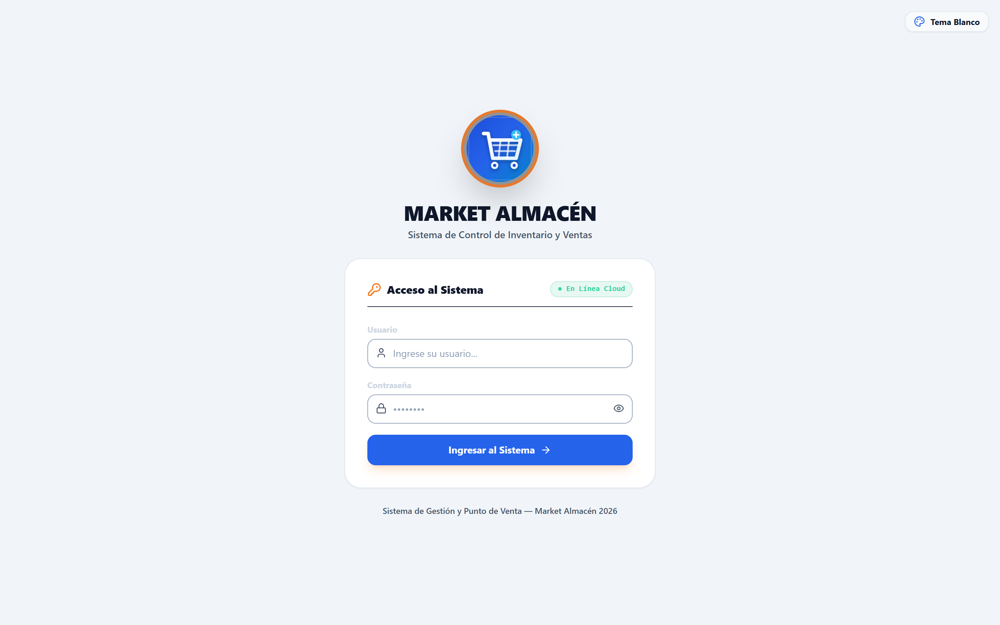
*Figura 2.1: Pantalla oficial de Inicio de Sesión de Market Almacén con selección de perfil de acceso seguro (Vendedor y Administrador).*

---

## CAPÍTULO 3: TERMINAL PUNTO DE VENTA (POS), COBRO RÁPIDO Y CIERRE (Z) MULTICAJA

El Terminal POS ofrece una interfaz de alta velocidad sin scroll externo, diseñada para operar fluidamente con pantallas táctiles, pistolas lectoras de código de barras o teclado físico:

      
        * **Botonera Rápida de Favoritos (9 Productos):** Acceso instantáneo a los artículos de mayor rotación (pan, abarrotes, bebidas) con un solo toque.

        * **Buscador Predictivo Multivariable:** Permite localizar productos instantáneamente por nombre, código de barras EAN-13, SKU interno o categoría.

        * **Cierres (Z) Multicaja:** Generación de arqueos de caja independientes por turno y por operador, detallando ventas en efectivo, tarjetas de débito (Redcompra), crédito y transferencias bancarias.

*Figura 3.1: Terminal Punto de Venta (POS) en pantalla principal, mostrando catálogo de favoritos, buscador predictivo y resumen de venta en vivo.*

*Figura 3.2: Modal de Cierre de Caja Z Multicaja con arqueo detallado, desglose por medio de pago e impresión de comprobante de cierre de turno.*

---

## CAPÍTULO 4: VENTA POR PESO Y GRANEL (BALANZA DIGITAL SIN SCROLL EXTERNO)

Para productos comercializados al peso (frutas, verduras, carnes, cecinas, quesos o frutos secos), Market Almacén integra un módulo especializado de balanza electrónica:

      
        * **Botones de Peso Rápido (Presets):** Botones táctiles precalibrados de 250 gramos (1/4 kg), 500 gramos (1/2 kg) y 1.000 gramos (1 kg) para agilizar la atención en mostrador.

        * **Ingreso Numérico de Gramos:** Campo numérico para digitar el peso exacto entregado por cualquier balanza digital comercial.

        * **Cálculo Automático en Tiempo Real:** Multiplica de inmediato los gramos pesados por el precio por kilo configurado en el sistema, incorporando el ítem al carrito con descripción exacta.

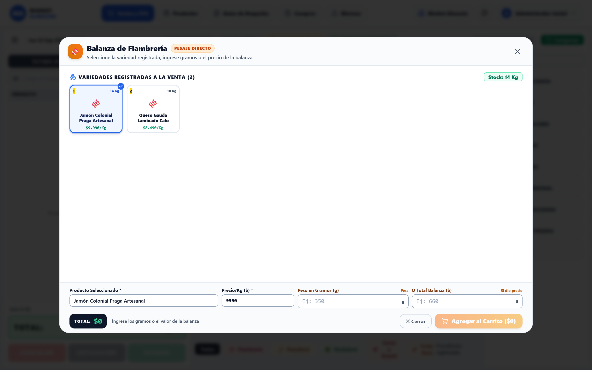
*Figura 4.1: Modal de Balanza Digital para venta por peso y granel, con selección de presets (250g, 500g, 1kg) y cálculo matemático exacto.*

---

## CAPÍTULO 5: CHECKOUT, FACTURACIÓN SII, VALIDACIÓN DE RUT Y CREACIÓN DE CLIENTES

El proceso de cobro se ejecuta en una sola ventana modal que unifica la selección del comprobante tributario y los medios de pago:

      
        * **Boleta Electrónica (DTE 39):** Cálculo en tiempo real del vuelto en efectivo con botones de billetes sugeridos y aplicación automática de la Ley de Redondeo de Chile.

        * **Factura Electrónica (DTE 33):** Validación algorítmica del dígito verificador del RUT del cliente con cálculo automático de crédito fiscal IVA (19%) y base neta.

        * **Inscripción Express de Clientes:** Si el RUT digitado no existe en la base de datos, el sistema abre de inmediato el formulario para registrar Razón Social, Giro Comercial, Dirección y Correo para despacho automático.

*Figura 5.1: Ventana de Checkout para Boleta Electrónica con cálculo automático de efectivo entregado y vuelto exacto.*

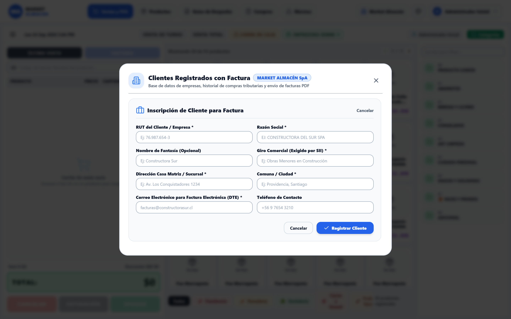
*Figura 5.2: Formulario de Checkout para Factura Electrónica con validación de RUT emisor, Razón Social, Giro y Dirección tributaria.*

---

## CAPÍTULO 6: HISTORIAL DE VENTAS, DTE, ANULACIONES Y MENÚ DE INFORMES

El Historial de Ventas ha sido optimizado con una estructura vertical interactiva orientada a la auditoría rápida:

      
        * **4 Botones Interactivos de Métricas:** En la parte superior se presentan las tarjetas de *Total Recaudado*, *Boletas Emitidas (39)*, *Facturas Emitidas (33)* y *Comprobantes Internos*, mostrando tanto la **cantidad total de documentos** como el **monto total acumulado ($)**. Al presionar cada botón, se filtra de inmediato la lista inferior.

        * **Listado Vertical hacia Abajo:** Presentación clara en filas con columnas de Folio/Tipo DTE, Fecha y Hora, Cliente/RUT, Medio de Pago, Items vendidos, Total y Botón de Acción.

        * **Buscador Multivariable y Calendario:** Filtro interactivo mediante selector de fechas tipo calendario y caja de búsqueda en tiempo real por número de folio, nombre del cliente o RUT.

        * **Tarjeta de Detalle del Documento:** Al hacer clic sobre cualquier fila del historial, se despliega la tarjeta completa del comprobante con opciones de Reimprimir Ticket/DTE, Enviar por Correo o Anular Documento.

        * **Desglose Tributario en Menú de Informes:** El centro de informes incorpora la sección *Desglose Tributario de Comprobantes Emitidos*, reflejando montos netos, IVA (19%) y totales recaudados tanto en pantalla como en el informe exportable en PDF.

*Figura 6.1: Historial de Ventas con los 4 Botones Interactivos de Métricas superiores (Total Recaudado, Boletas, Facturas y Venta Interna).*

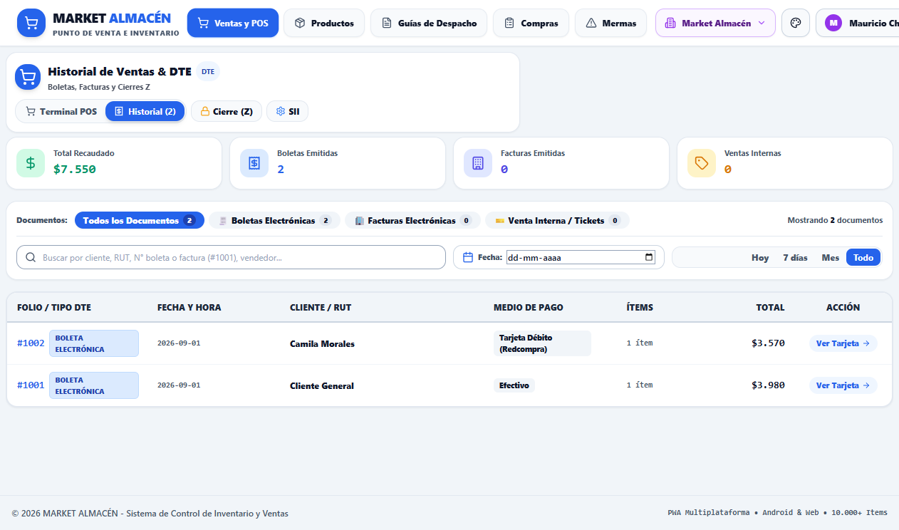
*Figura 6.2: Visualización del Historial de Ventas en formato de listado vertical estructurado hacia abajo con columnas de auditoría completa.*

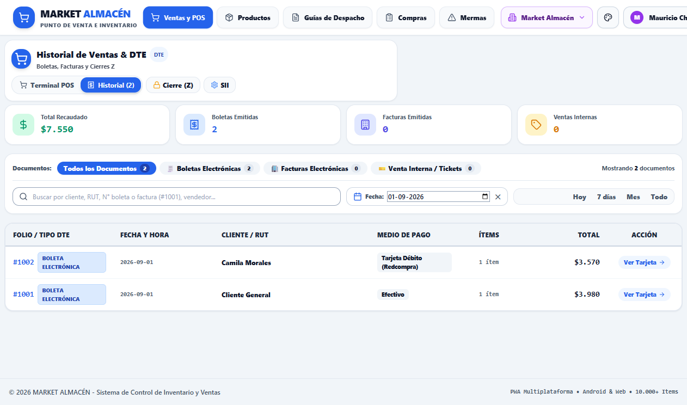
*Figura 6.3: Filtro interactivo mediante buscador de fechas tipo calendario y caja de búsqueda predictiva por cliente, RUT o folio.*

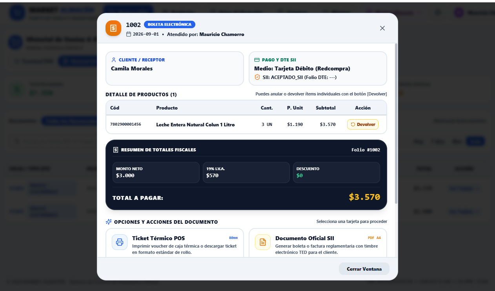
*Figura 6.4: Tarjeta de Detalle del Documento desplegada al presionar la fila, con opciones de Reimpresión, Envío por Correo y Anulación.*

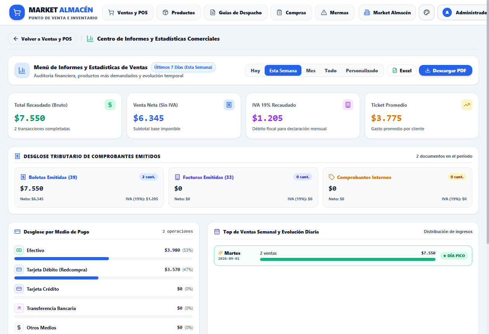
*Figura 6.5: Centro de Informes y Estadísticas de Ventas con la sección de Desglose Tributario de Comprobantes Emitidos y evolución comercial.*

---

## CAPÍTULO 7: GESTIÓN INTEGRAL DE INVENTARIO, FICHA DE PRODUCTO Y KARDEX

El módulo de inventario permite administrar miles de productos con trazabilidad en tiempo real:

      
        * **Ficha de Producto con Botonera Balanceada (2 Filas de 4 Botones):** Para máxima ergonomía visual, la botonera inferior se divide en *Operaciones de Movimiento* (Entrada rápida, Salida, Ajuste directo de stock e Historial Kardex) y *Operaciones Comerciales* (Activar Liquidación, Imprimir Código de Barras, Editar Ficha y Eliminar).

        * **Historial de Movimientos de Inventario (Kardex):** Registro inmutable que documenta cada movimiento de stock con fecha, hora, operador responsable, tipo de evento (Ingreso de compra, Venta POS, Merma, Ajuste manual) y saldo resultante.

        * **Filtro y Exportación a Excel (Exclusivo Admin):** Permite auditar la trazabilidad de un producto específico o de todos los productos en conjunto, con descarga directa a planilla Excel protegida para el Administrador.

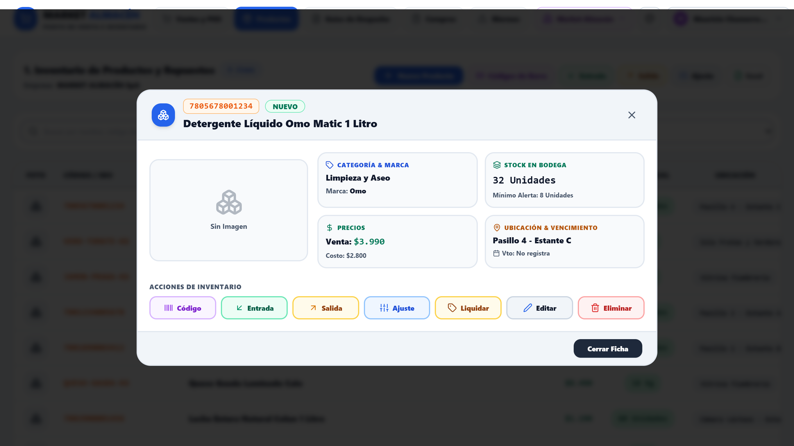
*Figura 7.1: Ficha de Producto con diseño mejorado en 2 filas limpias de 4 botones (Movimientos de stock en fila superior y Gestión comercial en fila inferior).*

*Figura 7.2: Modal de Historial de Movimientos (Kardex) con registro cronológico de entradas/salidas, saldos y botón de exportación a Excel para el Admin.*

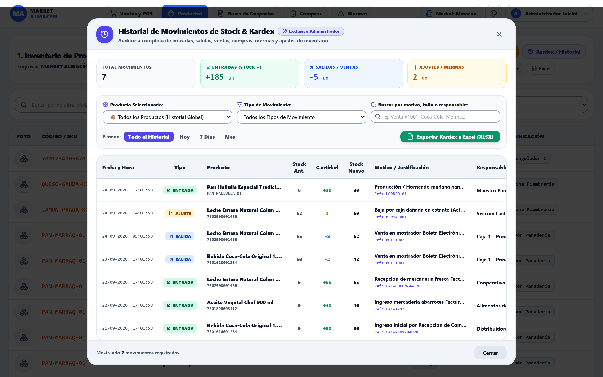
*Figura 7.3: Auditoría y trazabilidad histórica detallada para un producto específico seleccionado en el almacén.*

---

## CAPÍTULO 8: MODO LIQUIDACIÓN, ELECCIÓN DE PRECIO EN POS Y RETORNO AUTOMÁTICO

Market Almacén resuelve la gestión comercial de productos próximos a vencer o en oferta por lote acotado:

      
        * **Doble Opción de Precio al Vender:** Al escanear o seleccionar un producto en liquidación, el sistema despliega el *Modal de Elección de Precio* para que el cajero seleccione si el cliente accede al *Precio Liquidación* o al *Precio Normal de Lista*.

        * **Conmutación en el Carrito:** Ambos precios pueden convivir armónicamente en la misma venta, destacando los artículos en oferta con etiquetas visuales diferenciadas.

        * **Retorno Automático al Precio Normal:** Cuando se consume la última unidad del lote de liquidación disponible, el sistema revierte automáticamente el producto a su precio normal, protegiendo el margen de ganancia de las unidades nuevas.

        * **Edición Directa de Cantidades en Carrito:** Al pulsar el contador de cantidad en el carrito, se abre una ventana modal donde el cajero puede escribir el número solicitado por el cliente directamente con el teclado numérico.

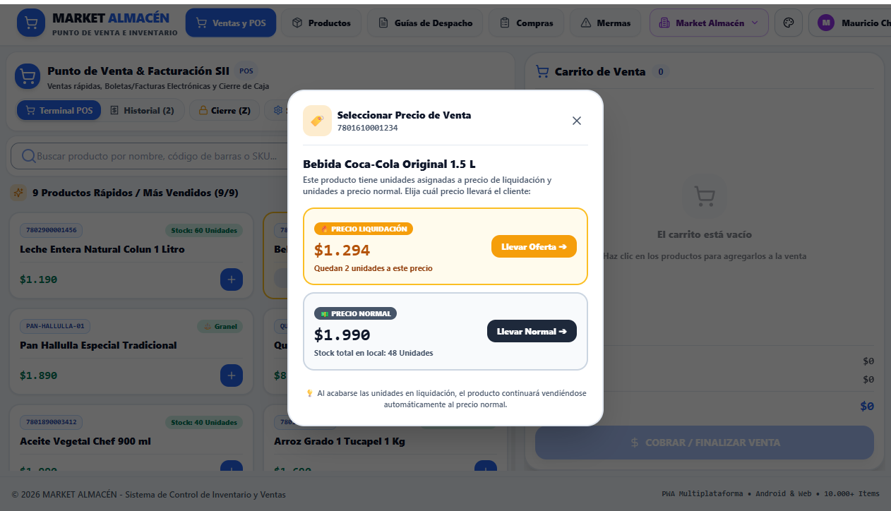
*Figura 8.1: Modal de Elección de Precio en POS: el cajero decide si cobrar el Precio de Liquidación o el Precio Normal de Lista.*

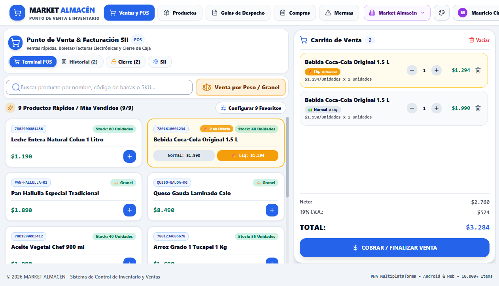
*Figura 8.2: Carrito de ventas conviviendo con artículos a precio de liquidación y artículos normales con cálculo exacto de subtotales.*

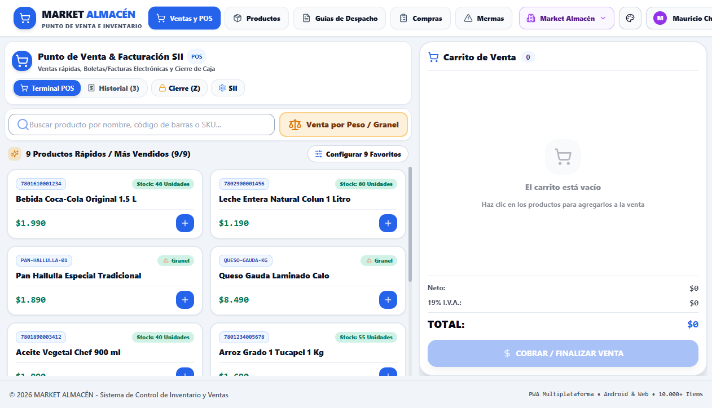
*Figura 8.3: Reversión automática a precio normal de lista una vez agotadas las unidades asignadas a la liquidación.*

*Figura 8.4: Modal para editar y anotar directamente con teclado la cantidad de unidades solicitadas por el cliente en el carrito.*

---

## CAPÍTULO 9: SISTEMA DE GESTIÓN DE FOLIOS CAF (SII CHILE - SIMPLEAPI) MULTI-EMPRESA

El módulo de Folios CAF constituye el corazón tributario de Market Almacén, permitiendo obtener, almacenar y consumir folios autorizados por el SII de forma 100% automatizada e independiente por empresa:

      
        * **Acceso Exclusivo de Administrador:** Ubicado en la barra superior dentro del menú de sesión de usuario (`[ 📑 Sistema de Folios CAF ]`).

        * **Cuentas en Tiempo Real:** Tres tarjetas KPI monitorean permanentemente los *Folios Solicitados* (autorizados por el SII), los *Folios Usados* (emitidos en ventas) y los *Folios Disponibles* con el próximo número correlativo asignado.

        * **Solicitud Automática con un Clic:** El administrador elige la cantidad deseada (50, 100, 200 o 500 folios) y presiona el botón de solicitud. El sistema se conecta con SimpleAPI/SII y autoriza la remesa en segundos, mostrando el mensaje reglamentario: `✅ Folios del [desde] al [hasta] cargados y autorizados con éxito.`

        * **Alerta de Nivel Mínimo Elegible:** Permite fijar un umbral de seguridad (ej. 20 folios). Si el stock disponible desciende por debajo de esa cifra, se despliega una advertencia visual roja para prevenir el agotamiento de folios en caja.

        * **Tipos de DTE Soportados:** Pestañas dedicadas para *Boletas Electrónicas (39)*, *Facturas Electrónicas (33)* y *Notas de Crédito (61)*.

        * **Aislamiento Estricto por Empresa:** Cada empresa opera con su propio RUT emisor, su propia API Key y su propia bolsa de folios en la base de datos Supabase, con bloqueo pesimista (`FOR UPDATE`) que elimina cualquier riesgo de folios duplicados en ventas simultáneas.

*Figura 9.1: Acceso exclusivo para el Administrador al Sistema de Folios CAF desde el menú de sesión de usuario en la barra superior.*

*Figura 9.2: Panel de Gestión de Folios CAF con indicador de API SimpleAPI dedicada por empresa, ambiente y cuentas en tiempo real.*

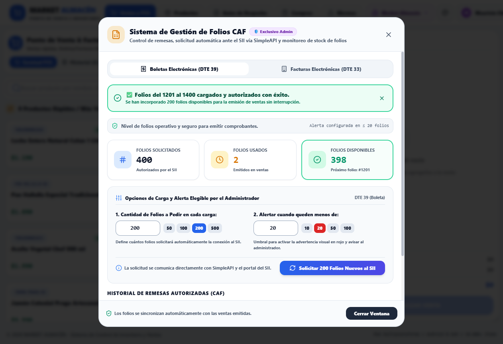
*Figura 9.3: Notificación de autorización exitosa: folios incorporados de forma automática desde el SII con actualización de inventario de folios.*

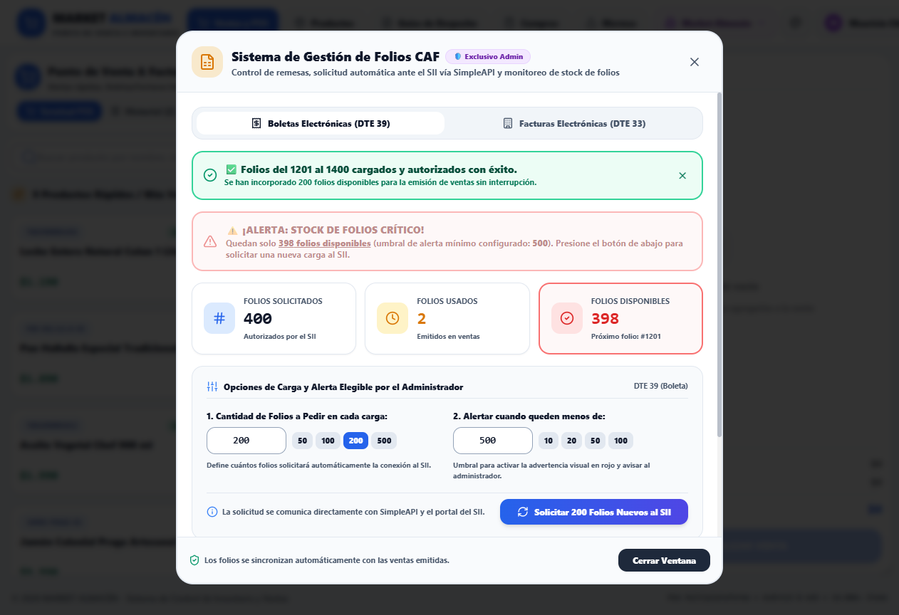
*Figura 9.4: Alerta visual roja de nivel crítico de folios activada al descender del umbral mínimo configurado por el Administrador.*

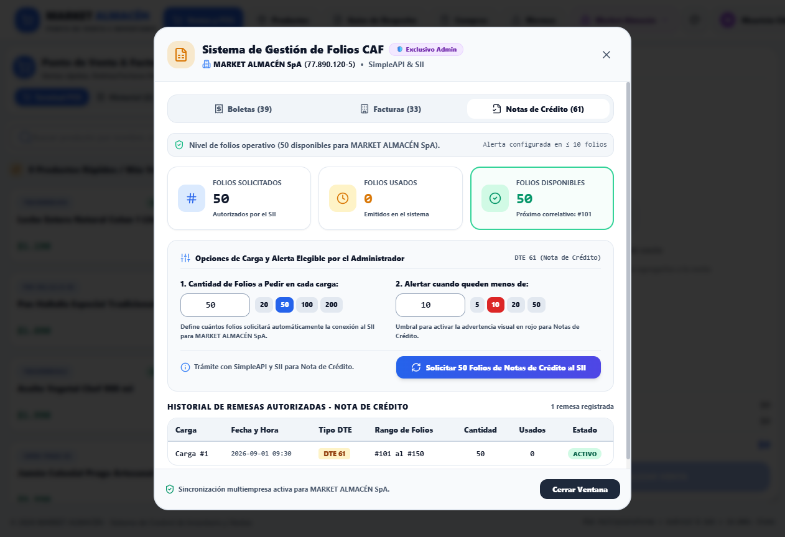
*Figura 9.5: Pestaña de Gestión y Carga de Folios para Notas de Crédito Electrónicas (DTE 61) autorizadas por el SII.*

---

## CAPÍTULO 10: GUÍAS DE DESPACHO Y RECEPCIÓN DE MERCADERÍA

Control formal de la entrada y salida de mercancías amparadas bajo guías de despacho electrónicas (DTE 52):

      
        * **Guías de Recepción (Entrada):** Permite verificar la mercadería física recibida de camiones o distribuidores, comparando unidades declaradas versus unidades efectivamente recepcionadas.

        * **Guías de Traslado o Entrega (Salida):** Emisión de guías de despacho para transporte de mercadería hacia sucursales o clientes mayoristas.

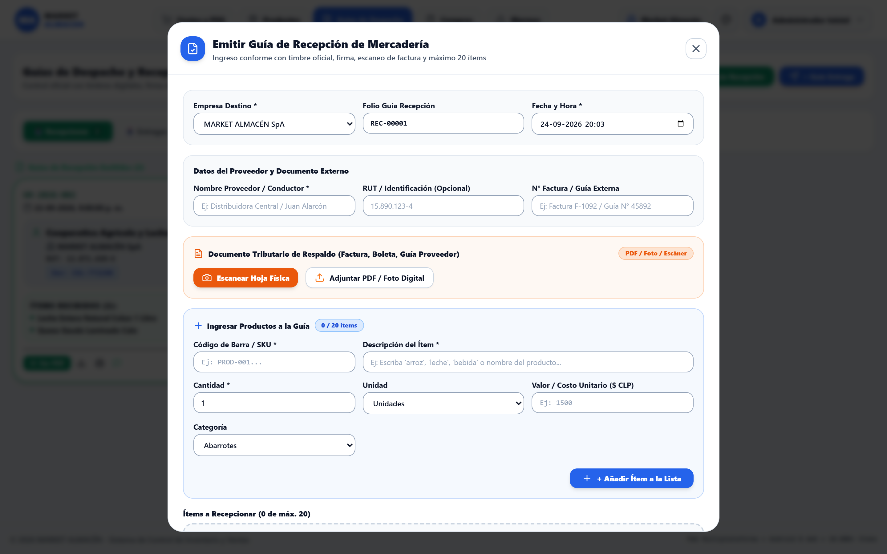
*Figura 10.1: Formulario de Recepción de Mercadería con validación de unidades recibidas, folio de guía y proveedor.*

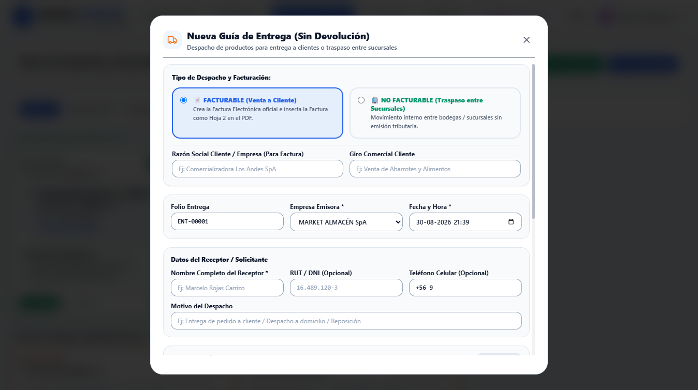
*Figura 10.2: Registro de Guía de Despacho para salida y traslado de mercaderías hacia sucursales o clientes.*

---

## CAPÍTULO 11: COMPRAS A PROVEEDORES Y CONTROL DE MERMAS

Gestión de abastecimiento y protección del patrimonio comercial del negocio:

      
        * **Registro de Facturas de Compra:** Permite ingresar costos netos de adquisición, actualizando el precio de costo ponderado de cada producto y alimentando el inventario automáticamente.

        * **Gestión de Mermas y Pérdidas:** Módulo para dar de baja mercadería por roturas, vencimiento o fallas de embalaje, descontando el stock físico y registrando el costo económico de la pérdida para efectos contables.

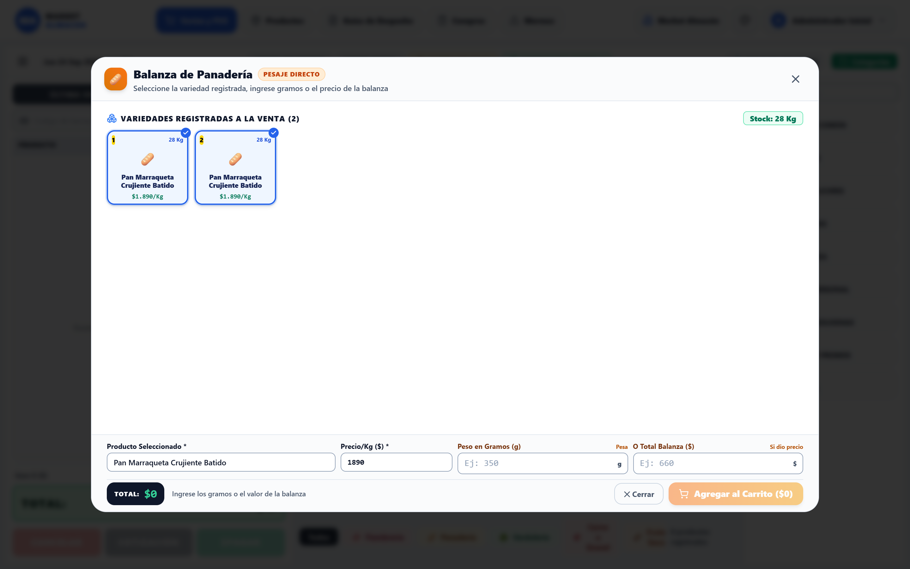
*Figura 11.1: Registro de Compras a Proveedores con detalle de costos netos, IVA crédito fiscal y actualización de stock.*

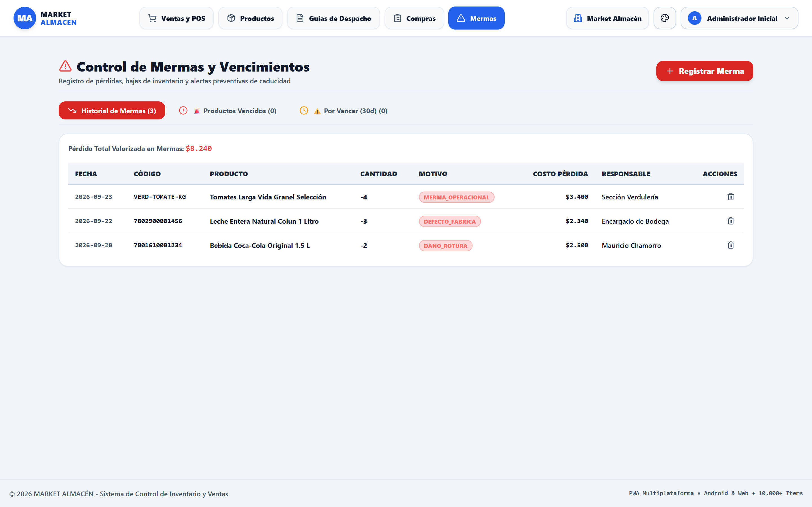
*Figura 11.2: Módulo de Registro y Control de Mermas por vencimiento, rotura o deterioro físico de productos.*

---

## CAPÍTULO 12: CONFIGURACIÓN DE EMPRESA, PARÁMETROS SII Y PERSONAL

Panel de ajustes exclusivo del Administrador para su razón social asignada:

      
        * **Datos de la Empresa:** RUT Emisor, Razón Social, Nombre de Fantasía, Giro Comercial, Dirección Casa Matriz y Teléfonos.

        * **Credenciales SII y SimpleAPI:** Configuración del Token SimpleAPI exclusivo de la empresa, ambiente de emisión (Certificación o Producción) y resolución tributaria.

        * **Gestión de Personal:** Creación de cuentas de vendedores y cajeros vinculados exclusivamente a esta empresa.

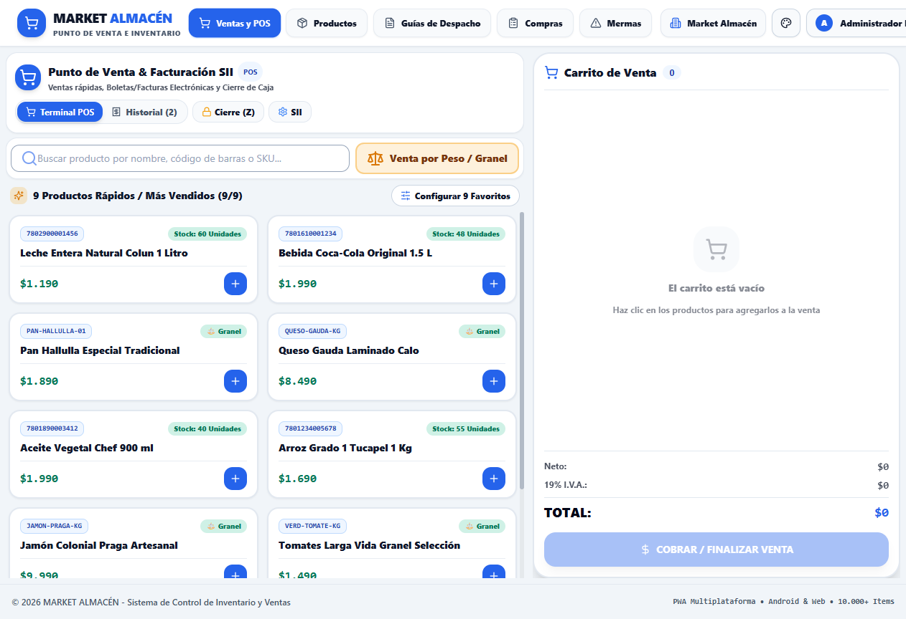
*Figura 12.1: Panel de Configuración de Empresa para el rol Administrador, enfocado exclusivamente en su propia razón social sin funciones de SuperAdmin.*

---

## CAPÍTULO 13: COPIA DE SEGURIDAD, MIGRACIÓN Y GESTIÓN DE MERCADERÍA EN EXCEL

Herramientas de respaldo y portabilidad de datos para proteger la información del almacén:

      
        * **Respaldo Total en Archivo JSON:** Genera una copia íntegra y cifrada de la base de datos local (productos, ventas, clientes, proveedores y folios) para guardarla en un pendrive o unidad externa.

        * **Importación y Exportación de Catálogo en Excel:** Permite descargar la planilla completa de productos, modificar precios masivamente en Microsoft Excel y reimportarla en segundos sin perder códigos ni fotos.

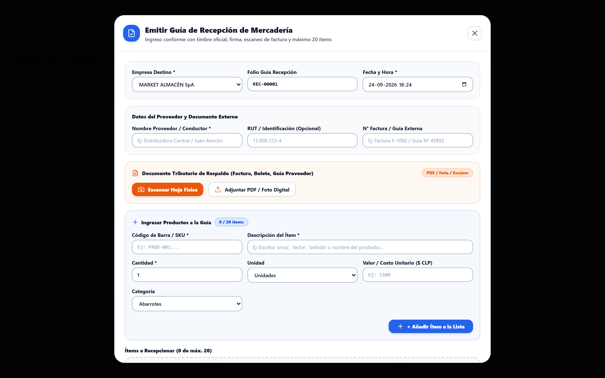
*Figura 13.1: Menú de Respaldo, Restauración de Base de Datos y Exportación/Importación de productos en formato Excel.*

---

## CAPÍTULO 14: PROVEEDORES, CLIENTES CON FACTURA Y TOMA DE INVENTARIO EN TIEMPO REAL

Módulos avanzados accesibles desde el menú de sesión de usuario para optimizar la logística del almacén:

      
        * **Directorios de Proveedores y Clientes con Factura:** Gestión de contactos comerciales con historial de compras, condiciones de crédito y envío de comprobantes en PDF por correo electrónico.

        * **Toma de Inventario en Tiempo Real (Múltiples Operadores):** Permite organizar cuadrillas de conteo físico simultáneo. Cada operador cuenta su sección o estante desde su teléfono o tablet; el sistema detecta si un producto ya fue contado y ofrece editar o sumar la cantidad para evitar duplicaciones.

        * **Consolidación y Sobrescritura (Modo Admin):** El Administrador supervisa el avance porcentual de cada equipo en vivo y, al finalizar la jornada, consolida las hojas con un informe de diferencias antes de sobrescribir el stock físico oficial.

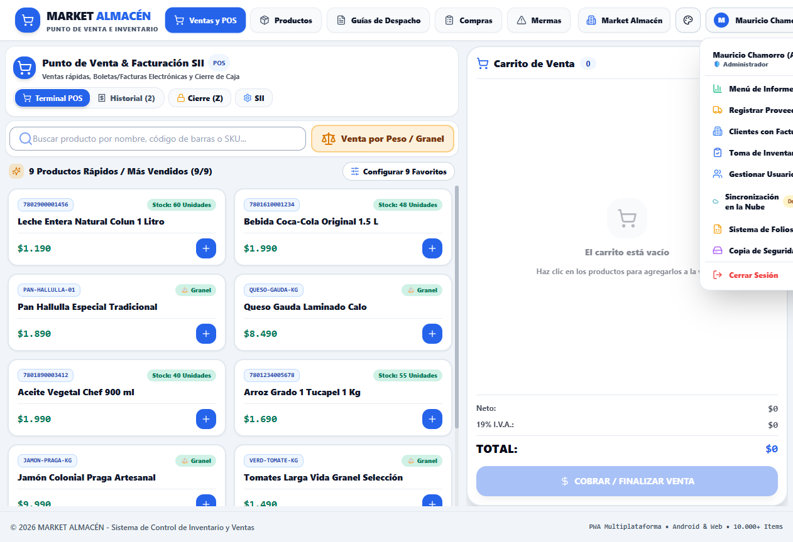
*Figura 14.1: Menú de sesión de usuario en la barra superior con accesos directos a Directorio de Clientes, Proveedores y Folios CAF.*

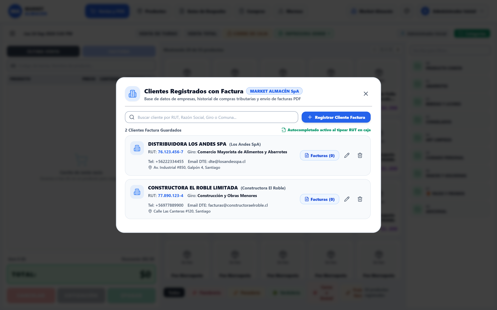
*Figura 14.2: Directorio de Clientes con Factura con consulta de historial de compras y datos tributarios registrados.*

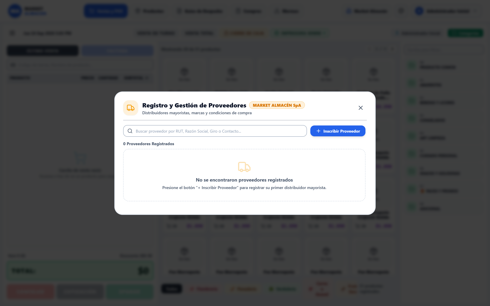
*Figura 14.3: Directorio de Proveedores Mayoristas con condiciones de pago, plazos y datos de contacto comercial.*

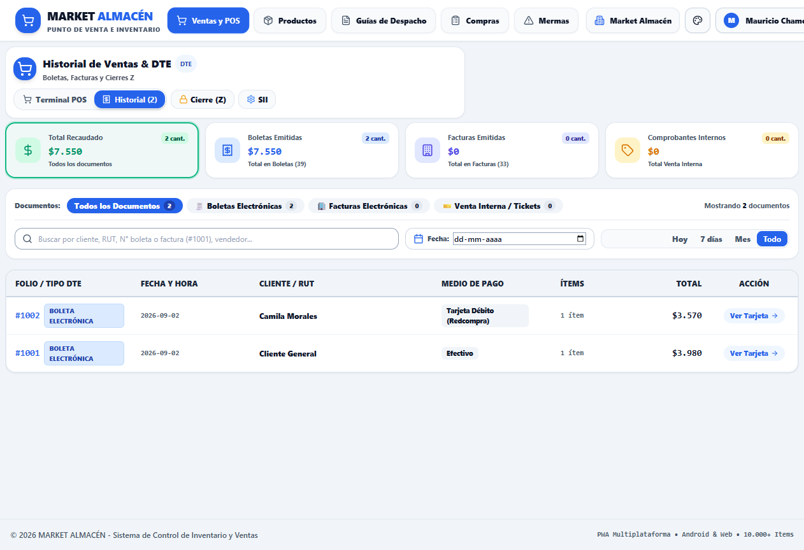
*Figura 14.4: Ventana de Envío de Factura y Comprobantes en formato PDF por correo electrónico directamente al cliente.*

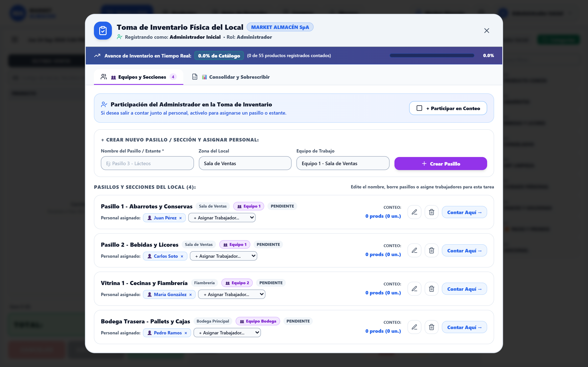
*Figura 14.5: Módulo de Conteo de Personal para toma de inventario físico en tiempo real mediante escaneo o búsqueda.*

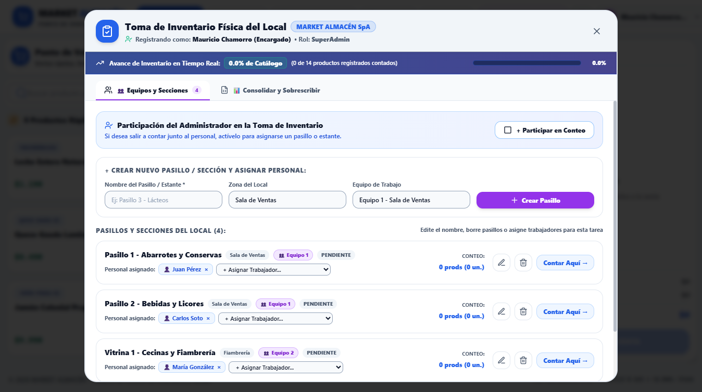
*Figura 14.6: Panel de Supervisión del Administrador mostrando avance en tiempo real por equipos y estantes de la bodega.*

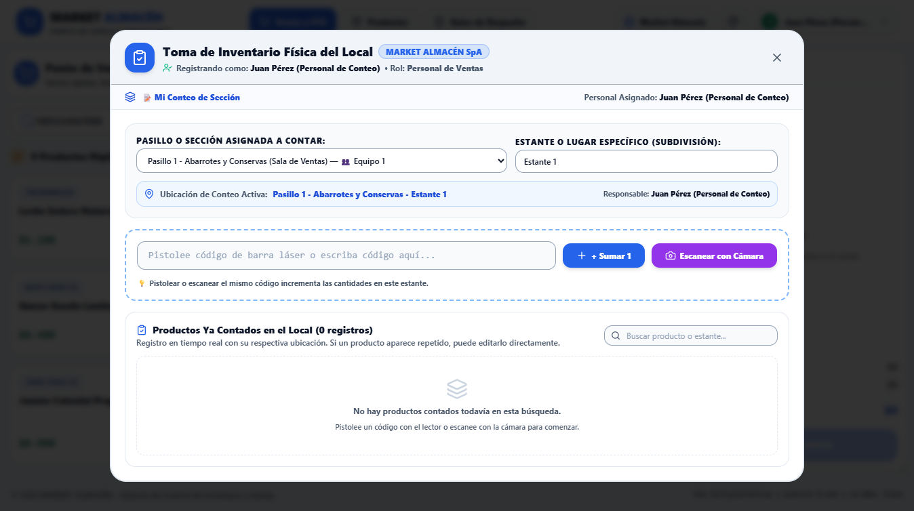
*Figura 14.7: Detección inteligente de producto repetido y modal de corrección o suma de cantidad para el operador.*

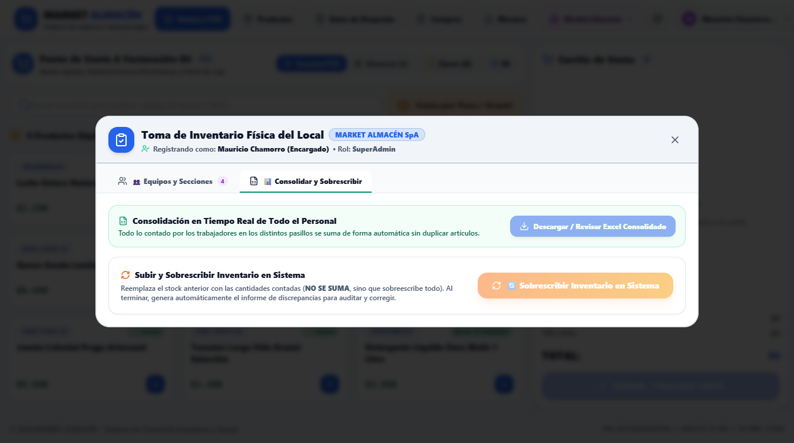
*Figura 14.8: Pantalla de Consolidación final y Sobrescritura de Inventario con informe comparativo de diferencias de stock.*

---

## CAPÍTULO 15: ADAPTABILIDAD MULTI-RUBRO, GIROS COMERCIALES Y SERVICIOS A MEDIDA

Market Almacén se adapta a la naturaleza específica de cualquier giro comercial chileno:

      
        * **Perfiles de Rubro Preconfigurados:** Minimarket y Abarrotes, Botillería, Panadería y Pastelería, Ferretería, Carnicería y Fiambrería, Verdulería y Frutería, Bazar y Librería, o Tienda de Mascotas.

        * **Adaptación Dinámica de la Balanza:** Los presets de peso y las unidades de medida se calibran según el rubro (kilogramos, gramos, litros, metros, piezas o packs).

        * **Servicios a Medida:** Capacidad de agregar ítems de servicios (reparaciones, despachos a domicilio, fotocopias, confecciones) con o sin control de stock físico.

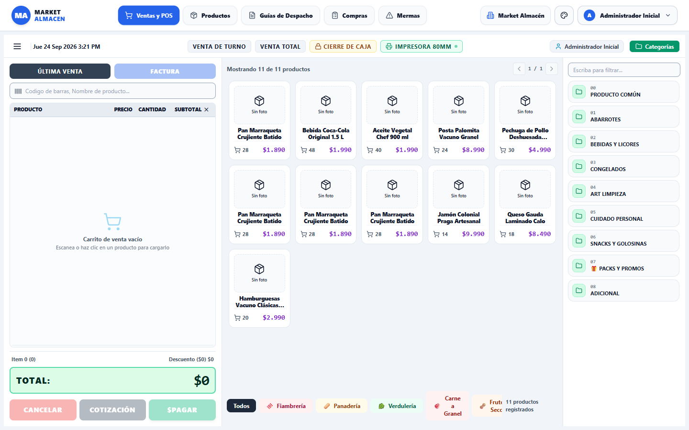
*Figura 15.1: Selector y personalización de Giros Comerciales y Rubros para adaptar el comportamiento del POS y la balanza.*

---

## CAPÍTULO 16: INSTALACIÓN EN ANDROID (APK) Y ACCESO WEB PWA

El sistema puede operar tanto en computadores de escritorio como en dispositivos móviles y terminales POS Android:

      
        * **Instalación en Android (Archivo APK):** Se provee el instalador `Market-Almacen.apk` listo para instalar en tablets y teléfonos Android 8.0 o superior, permitiendo utilizar la cámara del dispositivo como lector de código de barras.

        * **Acceso Web y PWA (Netlify):** Mediante el paquete `Market-Almacen-Web-Deploy.zip`, el sistema puede alojarse en Netlify con un solo arrastrar y soltar, permitiendo acceso seguro vía navegador desde cualquier lugar del país.

---

## CAPÍTULO 17: RECOMENDACIONES OPERATIVAS, VENTAJAS COMPETITIVAS Y MEJORES PRÁCTICAS

Para maximizar el rendimiento y la seguridad del negocio, se recomienda seguir estas mejores prácticas:

      
        * **Arqueo Diario Obligatorio:** Realizar el Cierre Z al término de cada turno o jornada laboral para conciliar de inmediato los montos en efectivo con el dinero físico en caja.

        * **Monitoreo Preventivo de Folios CAF:** Revisar semanalmente que los folios disponibles se mantengan sobre el umbral mínimo para evitar interrupciones en la emisión de boletas ante el SII.

        * **Respaldos Semanales:** Descargar periódicamente la copia de seguridad en archivo JSON hacia un dispositivo de almacenamiento externo seguro.

---
