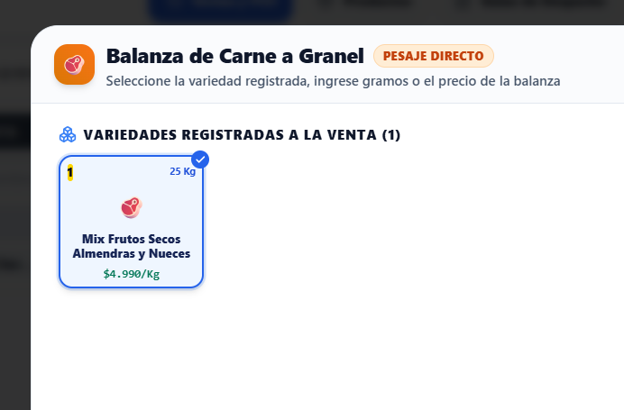
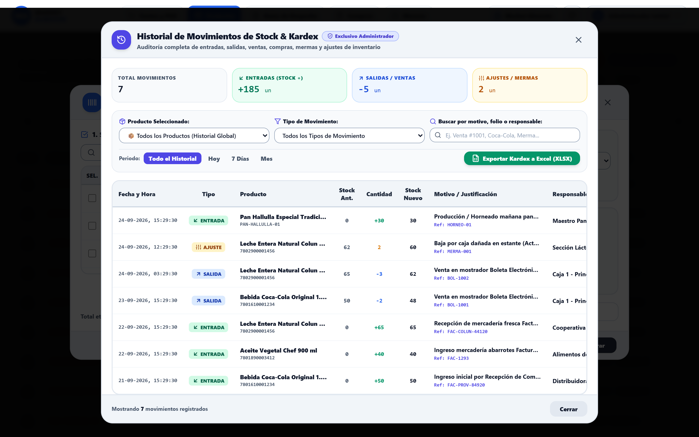
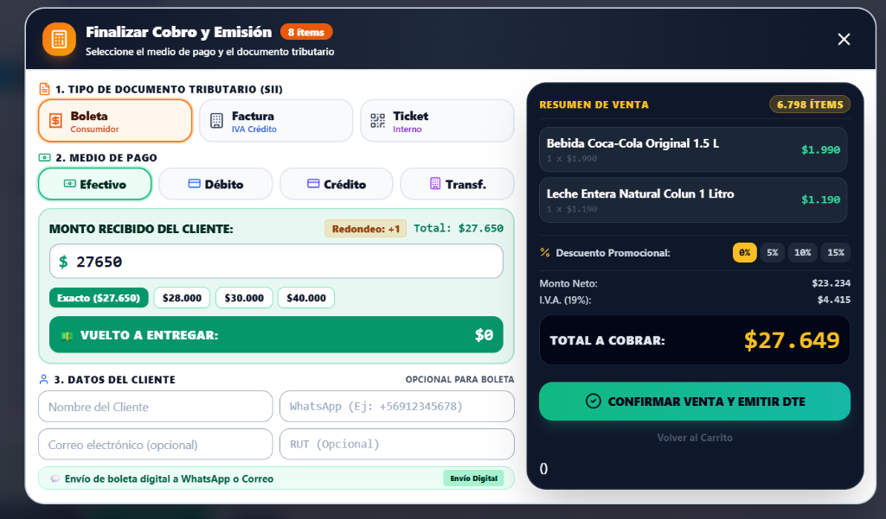
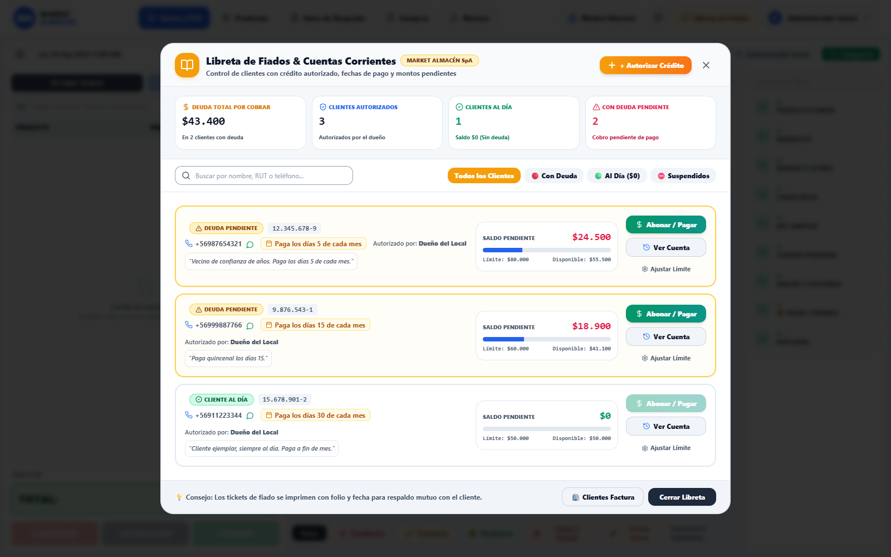
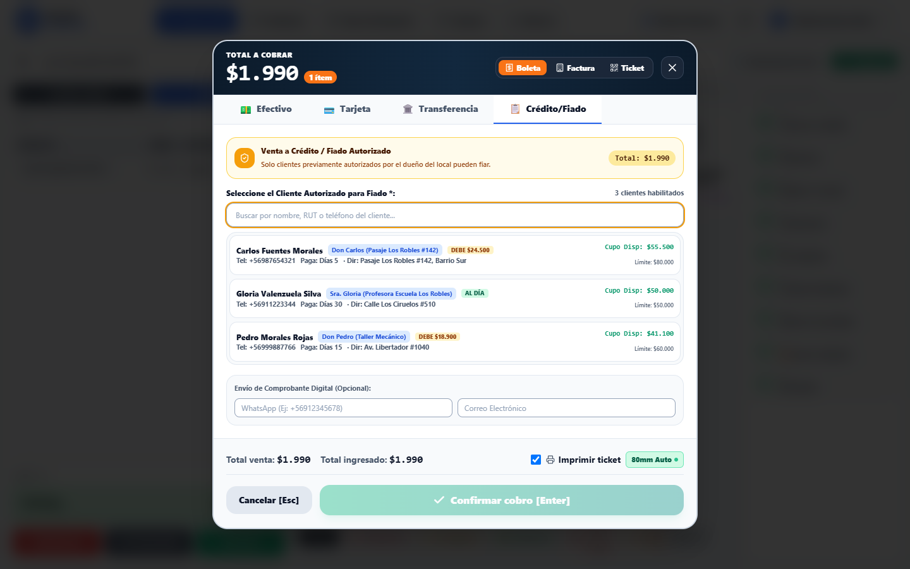
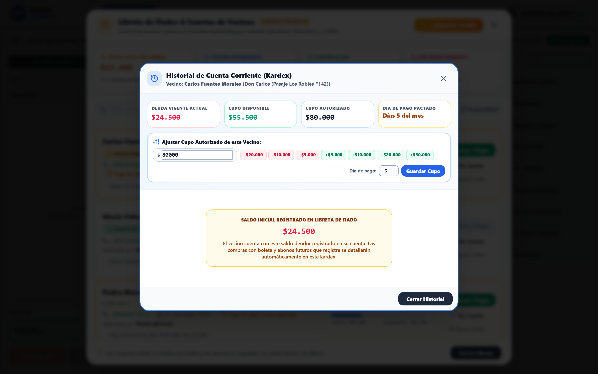
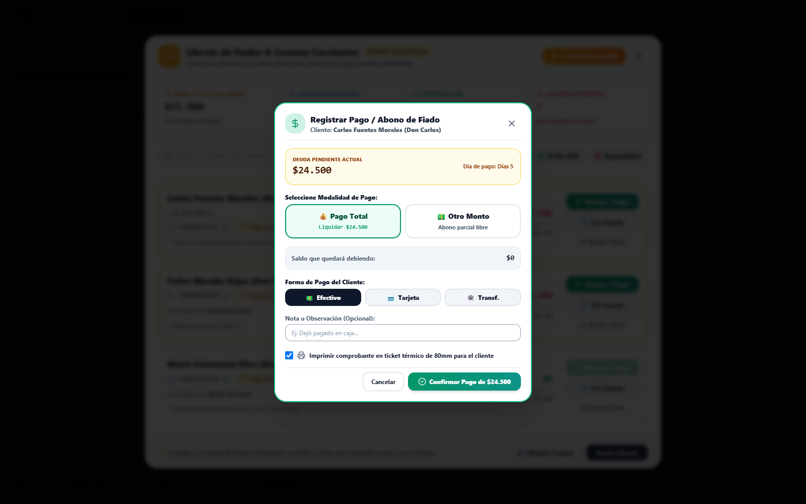
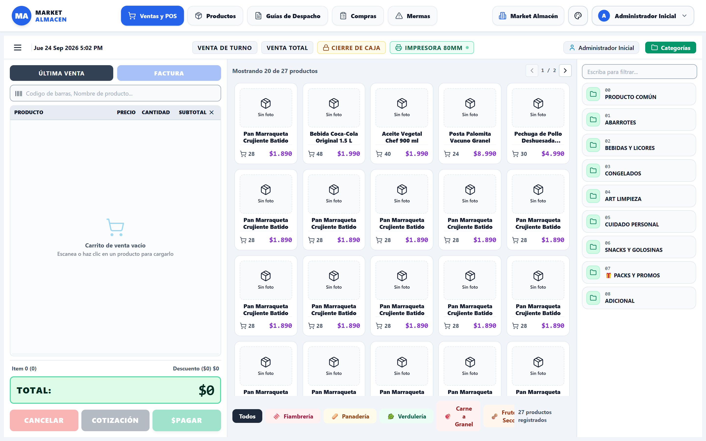
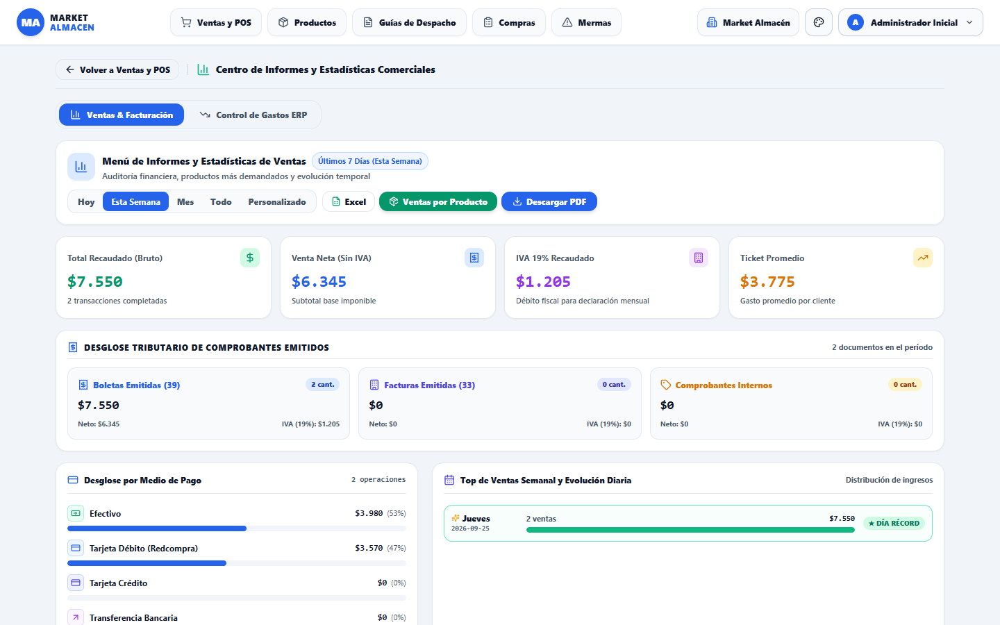
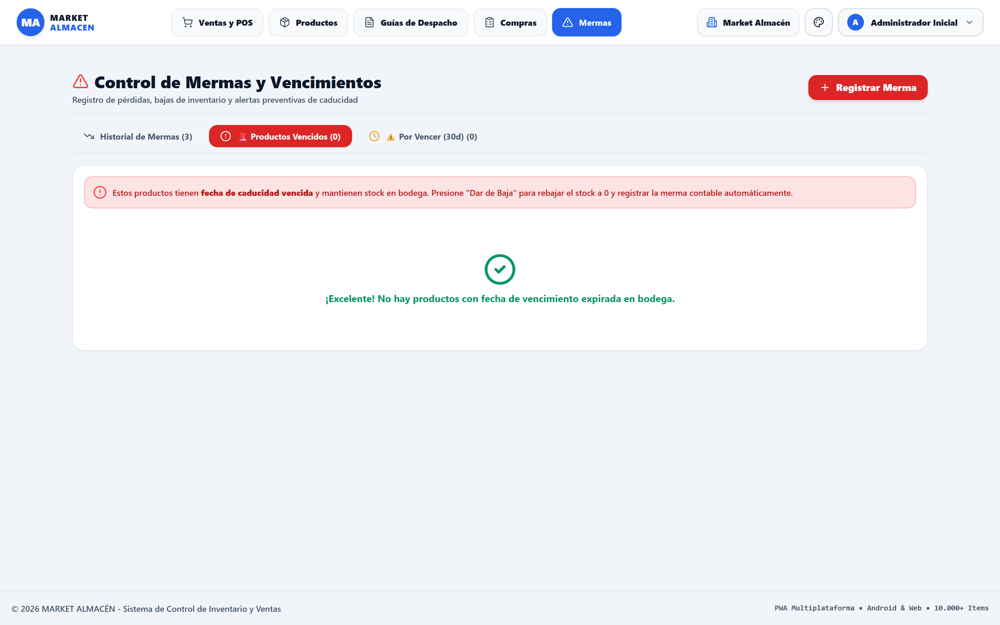

# 📖 MANUAL OFICIAL DE USUARIO & GUÍA OPERATIVA ILUSTRADA
## **MARKET ALMACÉN — Sistema Integral de Control de Inventario, POS, Facturación SII, Multicaja y Gestión Multi-Rubro**
*Edición Integral 2026 — Guía Exhaustiva de Operación para Cajeros, Encargados de Bodega y Administradores de Local*

---

> 📥 **Formatos Disponibles:** Este manual se encuentra disponible en formato web interactivo en [`MANUAL_DE_USUARIO_MARKET_ALMACEN.html`](./MANUAL_DE_USUARIO_MARKET_ALMACEN.html) y en formato imprimible de alta resolución en [`MANUAL_DE_USUARIO_MARKET_ALMACEN.pdf`](./MANUAL_DE_USUARIO_MARKET_ALMACEN.pdf). Para una consulta rápida durante el turno de mostrador, consulte la [`GUIA_RAPIDA_RESUMEN_MARKET_ALMACEN.md`](./GUIA_RAPIDA_RESUMEN_MARKET_ALMACEN.md).

---

## 📑 ÍNDICE GENERAL DEL MANUAL

1. **CAPÍTULO 1:** Introducción al Sistema, Filosofía Operativa y Roles en el Local (Cajero, Bodega, Administrador del Local)
2. **CAPÍTULO 2:** Terminal Punto de Venta (POS), Venta Rápida, Balanza Digital y Venta al Peso
3. **CAPÍTULO 3:** Venta de Carnes a Granel y Productos Congelados Pesados/Sellados con Etiqueta
4. **CAPÍTULO 4:** Modo Liquidación, Precios Rebajados y Generador de Packs / Promociones
5. **CAPÍTULO 5:** Pantalla de Cobro (Checkout), Medios de Pago e Impresión Térmica Automática 80mm/58mm
6. **CAPÍTULO 6:** Facturación Electrónica SII (Empresas con Giro y Razón Social)
7. **CAPÍTULO 7:** Libreta de Fiados & Cuentas de Vecinos (Compras con Boleta, Ver Cuentas, Aumento/Disminución de Cupo y Control de Sobrecupo)
8. **CAPÍTULO 8:** Arqueo de Caja y Cierre Z por Turno Multicaja
9. **CAPÍTULO 9:** Historial de Ventas, Auditoría de Documentos, Anulaciones y Menú de Informes
10. **CAPÍTULO 10:** Gestión de Inventario, Catálogo de Productos, Códigos de Barra y Kardex
11. **CAPÍTULO 11:** Guías de Despacho, Recepción de Mercadería y Compras a Proveedores
12. **CAPÍTULO 12:** Control de Mermas, Vencimientos y Pérdidas de Stock
13. **CAPÍTULO 13:** Toma de Inventario Físico en Tiempo Real y Respaldos en Excel
14. **CAPÍTULO 14:** Adaptabilidad Multi-Rubro: Casos Prácticos y Ejemplos de Configuración
15. **CAPÍTULO 15:** Instrucciones para Instalar y Ejecutar la Aplicación en Diferentes Dispositivos *(Penúltimo Capítulo Obligatorio)*
16. **CAPÍTULO 16:** Ventajas y Desventajas de Usar la Aplicación *(Último Capítulo Obligatorio)*

---

## CAPÍTULO 1: INTRODUCCIÓN AL SISTEMA, FILOSOFÍA OPERATIVA Y ROLES EN EL LOCAL

### 1.1 Propósito y Filosofía del Software
**Market Almacén** ha sido diseñado para erradicar las fallas críticas de los sistemas tradicionales de venta en el comercio minorista chileno: caídas por falta de internet, cobros mensuales abusivos, desorden en las libretas de fiados de papel y lentitud en los momentos de mayor afluencia de público. 

El sistema funciona bajo el paradigma **Offline-First**, almacenando la información localmente en el dispositivo mediante una base de datos indexada ultrarrápida. Las operaciones de venta, pesaje en balanza, control de caja y registro de deudas se ejecutan en milisegundos, sin depender de servidores externos ni de conexiones remotas.

### 1.2 Roles y Perfiles de Usuario en el Local
La aplicación cuenta con niveles de acceso adaptados a la jerarquía operativa de cualquier negocio:

* **Cajero / Vendedor (Mostrador):**
  * Acceso directo a la pantalla de ventas (POS), búsqueda de productos, balanza digital y lector de códigos de barra.
  * Emisión de Boletas Electrónicas, Facturas a empresas y Tickets internos.
  * Consulta y cobro a clientes registrados en la Libreta de Fiados según el cupo permitido.
  * Consulta de su propio arqueo y cierre de turno.
* **Encargado de Bodega / Inventario:**
  * Registro de recepción de mercadería con guías de despacho o facturas de proveedores.
  * Control de fechas de vencimiento, clasificación de productos por vencer y registro de mermas/averías.
  * Ensamblado y generación de packs promocionales con descuento automático de insumos.
  * Realización de tomas de inventario físico y conteo ciego en pasillos o góndolas.
* **Administrador / Dueño del Local:**
  * Control total de la tienda: creación y edición de productos, fijación de precios normales y de liquidación.
  * Autorización exclusiva de líneas de crédito en la Libreta de Fiados (aumento, disminución, bloqueo y sobrecupos).
  * Arqueo global de todas las cajas (Cierre Z consolidado).
  * Solicitud y carga de folios tributarios (CAF) ante el SII.
  * Exportación de respaldos contables a Excel y gestión de personal de turno.

*Figura 1.1: Pantalla de inicio de sesión con selección de usuario y clave de acceso.*

---

## CAPÍTULO 2: TERMINAL PUNTO DE VENTA (POS), VENTA RÁPIDA, BALANZA DIGITAL Y VENTA AL PESO

### 2.1 Interfaz Principal del Terminal POS
El punto de venta está optimizado para pantallas táctiles y teclado rápido:
* **Barra de Búsqueda Omnicanal:** Permite buscar productos por nombre, código de barras numérico o categoría con teclado físico o lector láser.
* **Botonera de Favoritos:** 9 botones táctiles de acceso instantáneo para productos de alta rotación (ej: Pan Batido, Hallulla, Bebida 1.5L, Huevos por bandeja).
* **Botonera Inferior de Accesos Rápidos:** Accesos directos a Venta por Peso general, Venta de Carne a Granel, y categorías frecuentes.

*Figura 2.1: Interfaz general del Terminal Punto de Venta (POS) optimizado para alta afluencia.*

### 2.2 Venta por Peso y Balanza Digital
Para negocios que comercializan productos al gramaje (frutas, verduras, frutos secos, quesos al corte, fiambres):
1. Presione el botón **`[ Venta por Peso / Granel ]`**.
2. Seleccione el producto del catálogo (ej: Tomate Larga Vida, Manzana Royal Gala, Queso Gauda Laminado).
3. Elija un preset táctil rápido (**`250g`**, **`500g`**, **`1.000g`**) o ingrese el peso exacto que marca la balanza (ej: `735` gramos).
4. El sistema calcula en milisegundos el precio proporcional exacto y lo envía al carrito.

*Figura 2.2: Modal de pesaje digital con presets de gramaje y cálculo automático sin scroll externo.*

### 2.3 Edición Rápida de Cantidades Anotadas en el Carrito
Si un cliente solicita 12 unidades de leche o 24 tarros de conserva, el cajero no necesita escanear 24 veces ni tocar 24 veces la pantalla:
1. Toque el número de cantidad del ítem en el carrito lateral.
2. Se abrirá el modal táctil **"Anotar Cantidad Solicitada"**.
3. Digite `24` en el teclado numérico integrado y presione Enter o Aceptar. El carrito actualiza el subtotal al instante.

*Figura 2.3: Modal táctil de edición directa de cantidad solicitada en el carrito.*

---

## CAPÍTULO 3: VENTA DE CARNES A GRANEL Y PRODUCTOS CONGELADOS PESADOS/SELLADOS CON ETIQUETA

### 3.1 Venta de Carne a Granel en Mostrador
En carnicerías, fiambrerías y minimarkets con sección de carnes frescas, los clientes solicitan cortes recién pesados frente a ellos:
1. Presione el botón inferior **`[ Carne a Granel ]`**.
2. El sistema filtra de forma estricta los productos del rubro cárnico (Posta Negra, Lomo Vetado, Pechuga de Pollo deshuesada, Costillar de Cerdo).
3. Ingrese los gramos exactos cortados en el mesón (ej: `1.240` gramos).
4. Presione **`[ Agregar Carne al Carrito ]`**. El ítem se agrega detallando el peso exacto y el precio por kilo correspondiente.

*Figura 3.1: Modal especializado de pesaje para carnes a granel (vacuno, cerdo, pollo y embutidos).*

### 3.2 Menú Lateral de Congelados (Carnes Selladas al Vacío y Procesados)
En el menú lateral de categorías, la opción **`Congelados`** agrupa:
* Carnes previamente pesadas, trozadas y selladas al vacío que ya cuentan con su etiqueta y código de barras individual.
* Hamburguesas envasadas, nuggets, papas prefritas, verduras congeladas y helados.
* Al escanear el código de barras de la bandeja sellada, el ítem se incorpora inmediatamente al carrito sin requerir recalcular gramaje en la balanza.

---

## CAPÍTULO 4: MODO LIQUIDACIÓN, PRECIOS REBAJADOS Y GENERADOR DE PACKS / PROMOCIONES

### 4.1 Modo Liquidación de Stock
Para productos con sobrestock o próximos a vencer, el comercio puede fijar un **Precio de Liquidación**:
1. Al escanear o seleccionar un producto marcado en liquidación, el cajero puede conmutar entre cobrar el **Precio Normal** o el **Precio Liquidación**.
2. Al presionar el botón superior **`[ Liquidar ]`**, se abre el panel de control de ofertas vigentes en el local.

*Figura 4.1: Panel de gestión de productos en liquidación y conmutación de precio en mostrador.*

### 4.2 Submenú Generador de Packs y Promociones
Dentro del modal de Liquidación, presione **`[ Generar Packs de Productos ]`** para crear combos y promociones comerciales:
* **Ejemplos por Rubro:**
  * *Botillería:* Pack Promo Pisco 750ml + Bebida Cola 1.5L + Bolsa de Hielo.
  * *Almacén / Desayuno:* Pack Once (1/2 kg Pan + Mantequilla 125g + Cecina Jamonada 100g).
  * *Pet Shop:* Pack Cachorro (Alimento 3kg + Plato comedero + Juguete mordedor).
* **Control Automático de Inventario:** El sistema calcula el stock máximo permitido de packs según el producto que tenga menor disponibilidad y **descuenta inmediatamente del inventario general** los insumos utilizados para crear el nuevo ítem con su propio código de barras.
* **Venta en POS:** Los packs generados aparecen organizados en la categoría lateral **`Packs / Promociones`** del punto de venta.

*Figura 4.2: Submenú de generación de packs con descuento automático de materias primas e insumos.*

---

## CAPÍTULO 5: PANTALLA DE COBRO (CHECKOUT), MEDIOS DE PAGO E IMPRESIÓN TÉRMICA AUTOMÁTICA

### 5.1 Pantalla de Checkout Multiformato
Al presionar el botón verde **`[ COBRAR / FINALIZAR VENTA (F4) ]`**, se despliega la pantalla de pago:
* **Efectivo:** Cálculo automático de vuelto aplicando la **Ley de Redondeo de Chile** (redondeo a los 10 pesos más cercanos en pagos en efectivo).
* **Tarjeta de Débito / Crédito:** Registro del código de operación del POS bancario (Transbank, Getnet, Klap, Mercado Pago).
* **Transferencia Bancaria:** Confirmación de comprobante y RUT del emisor.
* **Crédito / Fiado:** Panel especializado para vecinos autorizados con boleta (detallado en el Capítulo 7).

*Figura 5.1: Pantalla de Checkout con cálculo de vuelto, ley de redondeo y pestañas de pago.*

### 5.2 Configuración e Impresión Térmica Automática (80mm y 58mm)
El sistema cuenta con un motor de impresión térmica directa sin abrir ventanas emergentes del navegador:
1. En el menú superior o de configuración, abra **`[ Configurar Impresora Térmica ]`**.
2. Seleccione el ancho de papel de su gaveta: **80mm** (estándar de supermercado) o **58mm** (impresoras portátiles bluetooth/USB).
3. Active la casilla **`Imprimir Automáticamente al Cobrar`**.
4. Al confirmar la venta, la boleta o ticket se despacha inmediatamente a la impresora sin interrumpir el ritmo del cajero.

*Figura 5.2: Modal de configuración de impresora térmica POS con auto-impresión silenciosa.*

---

## CAPÍTULO 6: FACTURACIÓN ELECTRÓNICA SII (EMPRESAS CON GIRO Y RAZÓN SOCIAL)

### 6.1 Separación Estricta: Facturas a Empresas vs Boletas a Personas
Es fundamental comprender la arquitectura del sistema:
* **Factura Electrónica (DTE 33):** Exclusiva para empresas, contratistas o personas con giro comercial tributario. Requiere RUT de persona jurídica (76.xxx, 77.xxx), Razón Social, Giro registrado en el SII, Dirección y Correo electrónico DTE para el envío del XML.
* **Boleta Electrónica (DTE 39):** Para personas naturales, consumidores finales y compras cotidianas del hogar (incluyendo la Libreta de Fiados).

### 6.2 Búsqueda y Registro Rápido de Empresas
1. En la cabecera de la pantalla de cobro, presione el botón azul **`[ Factura ]`**.
2. Digite el RUT de la empresa compradora. Si ya ha comprado previamente, el sistema autocompleta su Razón Social, Giro y Correo.
3. Si es un cliente nuevo, presione **`[ + Crear Cliente Factura ]`**, ingrese los datos tributarios una sola vez y quedará registrado para siempre en la base de datos empresarial del local.

*Figura 6.1: Directorio y registro de clientes con Factura Electrónica y datos comerciales SII.*

*Figura 6.2: Modal de creación de nuevo cliente empresa para emisión de Facturas Electrónicas.*

---

## CAPÍTULO 7: LIBRETA DE FIADOS & CUENTAS DE VECINOS (COMPRAS CON BOLETA, VER CUENTAS, AJUSTE DE CUPO Y CONTROL DE SOBRECUPO)

> **NOTA DE FLEXIBILIDAD Y POLÍTICA COMERCIAL:**
> El módulo de **Crédito / Libreta de Fiados es 100% OPCIONAL** y queda a criterio exclusivo de cada empresa o comerciante. Si un local opera exclusivamente al contado y tarjeta (o decide por política interna no dar crédito a vecinos), simplemente no utiliza este menú ni asigna cupos. La aplicación continuará funcionando con máxima fluidez con boletas, facturas, efectivo, Transbank y transferencias, sin ninguna obligación de activar el módulo de fiados.

### 7.1 La Libreta de Fiados Electrónica
En el menú de administración del local, presione **`[ Libreta de Fiados & Cuentas ]`**:
* Reemplaza el cuaderno de papel por una base de datos segura y auditable de vecinos de confianza.
* Cada ficha registra: **Nombre del Vecino**, **Apodo o Referencia de Casa** (ej: Don Carlos - Pasaje Los Robles #142), **Teléfono / WhatsApp**, **Límite de Cupo Máximo ($)** y **Día pactado de pago del mes**.
* Todas las compras a fiado emiten **Boleta Electrónica** o ticket de caja, garantizando la debida tributación y orden contable.

*Figura 7.1: Directorio de la Libreta de Fiados con deuda actual, cupo y estado de pago de los vecinos.*

### 7.2 Venta a Fiado en Caja POS y Control de Sobrecupo
Cuando un vecino compra a fiado en la pantalla de cobro:
1. El cajero selecciona la pestaña **`Crédito / Fiado`**.
2. El sistema cambia automáticamente el documento a **Boleta Electrónica**.
3. El cajero busca al vecino por nombre, apodo o teléfono.
4. Si la compra está dentro del cupo disponible, se aprueba inmediatamente.
5. **Si la compra excede el cupo disponible (`finalTotal > availableCredit`), el sistema despliega el Selector de Decisión de Sobrecupo:**
   * **⛔ Opción 1: No Vender Pasando el Cupo (Por defecto):** El botón de cobro se bloquea. El vecino debe pagar la diferencia en efectivo/tarjeta o retirar productos.
   * **⚠️ Opción 2: Seguir Dando Fiado (Autorizar Sobrecupo Continuo):** Se autoriza la venta con sobrecupo y la cuenta del cliente continúa abierta para futuras compras.
   * **🛑 Opción 3: Última Venta Permitida (Sobrecupo de Excepción y Bloqueo):** Se permite llevar los productos en esta compra, pero la cuenta del vecino queda **inmediatamente BLOQUEADA** para futuros fiados con una nota en su ficha hasta que salde su deuda.
   * **⚡ Opción 4: Aumentar Cupo en Caja:** Permite subir el cupo permanente del vecino ahí mismo sin salirse de la venta.

*Figura 7.2: Pantalla de cobro a Fiado en POS con selección de cliente y alertas de cupo.*

### 7.3 Ver Cuentas: Historial Kardex y Ajuste Rápido de Cupo (Aumentar / Disminuir)
Al presionar el botón **`[ Ver Cuenta ]`** de cualquier cliente en la Libreta de Fiados:
* Se abre el **Historial de Cuenta Corriente (Kardex)** detallando cada compra con boleta y cada abono registrado.
* **Panel Superior de Ajuste de Cupo:**
  * Muestra la Deuda Actual, Cupo Disponible y Cupo Autorizado.
  * Permite **aumentar o disminuir el cupo** según la situación de cada cliente mediante botones táctiles rápidos (**`-$20.000`**, **`-$10.000`**, **`-$5.000`**, **`+$5.000`**, **`+$10.000`**, **`+$20.000`**, **`+$50.000`**) o ingresando el monto directamente.
  * Permite modificar el día de pago pactado del mes y guardar con confirmación inmediata.

*Figura 7.3: Historial Kardex de cuenta corriente del vecino con panel interactivo de aumento y disminución de cupo.*

### 7.4 Registro de Abonos y Pagos con Comprobante Térmico
Cuando el cliente se acerca al local a pagar su cuenta:
1. En la Libreta de Fiados presione **`[ Abonar / Pagar ]`**.
2. Elija **Pago Total** (saldar el 100% de la deuda) o **Abono Parcial** ingresando el monto que entrega.
3. Seleccione la forma de pago (Efectivo, Débito o Transferencia).
4. El sistema descuenta la deuda al instante y emite automáticamente el **Comprobante Térmico de Abono en 80mm/58mm** con saldo anterior, monto pagado y nuevo saldo restante.

*Figura 7.4: Modal de registro de abono o pago total con emisión de comprobante térmico.*

---

## CAPÍTULO 8: ARQUEO DE CAJA Y CIERRE Z POR TURNO MULTICAJA

### 8.1 Procedimiento de Cierre Z
Al término del turno del cajero o al finalizar la jornada comercial:
1. En la barra superior del terminal POS presione **`[ Cierre (Z) ]`**.
2. El sistema genera el resumen financiero consolidado:
   * Total Efectivo recaudado (desglosado con redondeo de ley).
   * Total Tarjeta Débito y Crédito.
   * Total Transferencias electrónicas confirmadas.
   * Total Ventas a Fiado cargadas a cuentas corrientes de vecinos.
   * Total Abonos de fiados recibidos en efectivo en el turno.
3. Presione **`[ Imprimir Cierre Z ]`** para obtener el comprobante de auditoría que se guarda junto al dinero en el sobre de recaudación.

*Figura 8.1: Comprobante de Arqueo y Cierre Z Multicaja con desglose por medio de pago.*

---

## CAPÍTULO 9: HISTORIAL DE VENTAS, AUDITORÍA DE DOCUMENTOS, ANULACIONES Y MENÚ DE INFORMES

### 9.1 Consulta y Auditoría de Ventas
En el menú superior **`[ Historial de Ventas ]`**:
* **Tarjetas de Métricas en Cabecera:** Consulte de un vistazo el Total Recaudado, Boletas Emitidas, Facturas Emitidas y Ventas Internas.
* **Filtros por Fecha y Búsqueda por Folio o RUT:** Permite encontrar en segundos una compra específica realizada días o semanas atrás.
* **Tarjeta de Documento:** Al presionar cualquier venta en el listado, se abre la tarjeta interactiva que permite reimprimir el ticket original, descargar el PDF tributario o enviar el comprobante por correo electrónico.

*Figura 9.1: Historial vertical de ventas con tarjetas interactivas y métricas superiores.*

*Figura 9.2: Modal de opciones de documento: reimpresión, visualización y anulación con nota de crédito.*

### 9.2 Informes de Ventas en PDF
Presione **`[ Menú de Informes ]`** para generar reportes ejecutivos en PDF de ventas por día, por vendedor, por categoría o por medio de pago, ideales para el contador o la revisión mensual del negocio.

*Figura 9.3: Reporte contable de ventas consolidado en PDF con formato profesional.*

---

## CAPÍTULO 10: GESTIÓN DE INVENTARIO, CATÁLOGO DE PRODUCTOS, CÓDIGOS DE BARRA Y KARDEX

### 10.1 Catálogo de Productos y Ficha Técnica
En el menú **`[ Productos / Inventario ]`**:
* Buscador por nombre, marca, categoría o código de barras.
* Filtros por estado de stock: Todos, Stock Bajo, Sin Stock y En Liquidación.
* Al crear o editar un producto, defina: Nombre, Categoría, Unidad de Medida (Unidad, Kilogramo, Litro, Metro), Código de Barras (EAN-13 o interno), Costo Neto, Margen de Utilidad, Precio de Venta Normal, Precio de Liquidación y Stock Mínimo de Alerta.

*Figura 10.1: Catálogo de productos con indicadores de stock crítico, costos y precios de venta.*

### 10.2 Trazabilidad de Stock (Kardex por Producto)
Dentro de la ficha de cualquier producto, presione **`[ Ver Kardex de Movimientos ]`**:
* Registro cronológico inalterable de cada ingreso por compra o guía, salida por venta en caja, merma por rotura o ajuste de conteo físico.
* Detalla fecha, hora, tipo de movimiento, número de folio asociado, variación de stock y saldo resultante.

*Figura 10.2: Kardex detallado de movimientos de entrada, salida y saldo de un producto específico.*

### 10.3 Impresión de Códigos de Barra para Góndolas y Productos
En **`[ Imprimir Códigos de Barra ]`**:
* Seleccione los productos que no traen código de fábrica (ej: legumbres envasadas por el almacén, quesos trozados, tornillos en ferretería).
* Genere hojas de etiquetas adhesivas listas para imprimir y pegar en la góndola o en el empaque.

*Figura 10.3: Módulo de generación e impresión de etiquetas de código de barras para estanterías.*

---

## CAPÍTULO 11: GUÍAS DE DESPACHO, RECEPCIÓN DE MERCADERÍA Y COMPRAS A PROVEEDORES

### 11.1 Recepción de Mercadería con Guía de Despacho
Cuando el camión de distribución llega con el pedido:
1. Abra el módulo **`[ Guías de Despacho ]`** y seleccione la pestaña **`Recepciones`**.
2. Presione **`[ + Nueva Recepción ]`**, ingrese el RUT del proveedor, número de guía o factura de compra.
3. Agregue los productos recibidos y las cantidades físicas ingresadas.
4. Al confirmar la recepción, el inventario se incrementa de forma automática en el sistema y se registra la entrada en el Kardex.

*Figura 11.1: Módulo de control de guías de despacho y recepción de mercadería de proveedores.*

*Figura 11.2: Formulario de ingreso de mercadería con validación de cantidades y costos de compra.*

### 11.2 Órdenes de Compra a Proveedores
En el módulo **`[ Compras ]`**, el administrador puede generar órdenes de compra oficiales con los productos con stock bajo para enviar directamente por WhatsApp o correo al proveedor.

*Figura 11.3: Panel de órdenes de compra a proveedores con cálculo de reposición sugerida.*

---

## CAPÍTULO 12: CONTROL DE MERMAS, VENCIMIENTOS Y PÉRDIDAS DE STOCK

### 12.1 Registro de Mermas y Desmedros
En el módulo **`[ Control de Mermas ]`**:
* Registre pérdidas causadas por vencimiento de fecha, roturas de envases, averías o productos no aptos para el consumo.
* Cada merma descuenta el stock inmediatamente y exige registrar el motivo, el responsable y el costo de la pérdida.

*Figura 12.1: Panel central de control de mermas y desmedros de inventario.*

### 12.2 Alertas de Vencimiento Preventivo
El sistema monitorea las fechas de vencimiento registradas en cada lote y clasifica los productos en:
* **Vencidos:** Retiro inmediato de góndola.
* **Por Vencer (Próximos 7 a 15 días):** Candidatos ideales para activar en el **Modo Liquidación** o incluir en **Packs Promocionales** antes de que generen pérdida total.

*Figura 12.2: Listado de auditoría de productos vencidos con opción de baja inmediata de inventario.*

---

## CAPÍTULO 13: TOMA DE INVENTARIO FÍSICO EN TIEMPO REAL Y RESPALDOS EN EXCEL

### 13.1 Toma de Inventario Físico (Conteo Ciego en Góndola)
Para cuadrar las existencias teóricas del sistema contra lo que realmente hay en las repisas:
1. Abra **`[ Toma de Inventario ]`** desde una tablet o computador portátil.
2. Escanee los productos pasillo por pasillo e ingrese la cantidad física contada.
3. El sistema realiza una consolidación comparativa: resalta sobrantes en verde y faltantes en rojo.
4. El administrador puede revisar el informe de diferencias y presionar **`[ Sobrescribir Inventario ]`** para actualizar el stock real en un solo paso.

*Figura 13.1: Pantalla de conteo físico en pasillo con lector de código de barras para toma de inventario.*

### 13.2 Respaldos Completos en Excel
En **`[ Respaldo & Exportación ]`**, descargue copias completas de su base de datos en formato Excel (.xlsx): Catálogo con costos y precios, Clientes con Factura, Libreta de Fiados y Registro de Ventas para salvaguardar su información.

*Figura 13.2: Módulo de respaldo y exportación de inventario y cuentas a planillas Excel.*

---

## CAPÍTULO 14: ADAPTABILIDAD MULTI-RUBRO: CASOS PRÁCTICOS Y EJEMPLOS DE CONFIGURACIÓN

Market Almacén se adapta dinámicamente a las necesidades comerciales específicas de diferentes negocios con un solo clic:

*Figura 14.1: Selector de giro y rubro comercial que adapta terminología, balanza e impuestos del negocio.*

### 14.1 Casos de Uso por Rubro

| Rubro Comercial | Funcionalidades Clave Utilizadas | Ejemplo Práctico de Operación |
| :--- | :--- | :--- |
| **Almacén / Minimarket** | Botonera de 9 favoritos, Boletas, Libreta de Fiados de vecinos. | Venta express de pan y cecinas; registro de compra a Don Carlos a fiado hasta el día 5 de su sueldo. |
| **Carnicería / Fiambrería** | Balanza digital de Carne a Granel, Categoría Congelados sellados. | Pesaje al corte de Posta Negra (1.250g) en el mesón; escaneo directo de cortes congelados al vacío con etiqueta. |
| **Botillería / Licorería** | Generador de Packs / Promociones, control estricto de caja Z. | Creación de Pack 'Promo Terremoto' o 'Promo Piscola' descontando destilado y gaseosa automáticamente; arqueo nocturno. |
| **Panadería / Pastelería** | Pesaje de pan por kilo en balanza, Liquidación fin de jornada. | Presets de 500g y 1kg de Hallulla; activación de modo liquidación con 40% de descuento en pasteles después de las 20:00 hrs. |
| **Verdulería / Frutería** | Venta al peso con presets de gramaje, Control de mermas por maduración. | Pesaje rápido de tomates y plátanos; pase a merma de fruta sobremadurada para mantener el costo real. |
| **Ferretería de Barrio** | Libreta de Fiados para maestros, códigos de barra adhesivos. | Línea de crédito a maestros contratistas que pagan al terminar la obra; etiquetas adhesivas en tornillos a granel. |
| **Pet Shop / Veterinaria** | Alimento a granel por kilo, Packs de accesorios. | Venta de 2.5 kg de alimento para perro en bolsa pesada; Pack 'Bienvenida Cachorro' (Comedero + Alimento + Juguete). |

---

## CAPÍTULO 17: INSTRUCCIONES PARA INSTALAR Y EJECUTAR LA APLICACIÓN EN DIFERENTES DISPOSITIVOS

*(Penúltimo Capítulo Obligatorio)*

Market Almacén es una aplicación multiplataforma de vanguardia construida con tecnología web progresiva (PWA) y encapsulada nativamente en Android con Capacitor. Puede ejecutarse en una amplia gama de dispositivos comerciales:

### 15.1 En Computadores y Notebooks (Windows / macOS / Linux)
1. **Acceso Web:** Abra Google Chrome, Microsoft Edge o Brave e ingrese a la dirección URL local o al enlace de despliegue web de su local.
2. **Instalación como Aplicación de Escritorio (PWA):**
   * En la barra de direcciones del navegador, haga clic en el ícono de **Instalar Aplicación** (ícono de monitor con flecha).
   * La aplicación se instalará como un programa de escritorio independiente con su propio ícono en el Escritorio y Barra de Tareas.
   * Se ejecuta a pantalla completa, sin barras de navegación del explorador, ofreciendo máxima velocidad y ergonomía al cajero.
3. **Impresoras y Balanzas USB:** Conecte su lector de código de barras USB y su impresora térmica de 80mm/58mm. Windows los reconocerá automáticamente como dispositivos Plug & Play.

### 15.2 En Teléfonos Móviles Android (Instalación APK)
Para propietarios o administradores que deseen revisar stock, ventas o registrar fiados desde su teléfono celular:
1. Copie el archivo instalador **`app-debug.apk`** (o **`Market-Almacen.apk`**) a la memoria de su teléfono celular (vía WhatsApp, correo o cable USB).
2. Abra el Administrador de Archivos de su teléfono y toque el archivo APK.
3. Si el sistema muestra la advertencia de seguridad, seleccione **`Permitir instalar aplicaciones de orígenes desconocidos`** en los Ajustes de su teléfono.
4. Presione **`Instalar`**. Al finalizar, la aplicación quedará lista con su ícono en la pantalla de inicio.
5. Abre y funciona 100% de forma autónoma sin requerir servidores externos.

### 15.3 En Tablets Android (Mostrador y Conteo en Pasillo)
Ideal para puntos de venta minimalistas de mostrador o para realizar tomas de inventario físico caminando por el almacén:
1. Instale el archivo APK en su Tablet Android (Samsung Galaxy Tab, Lenovo Tab, Xiaomi Pad, etc.).
2. En la configuración de pantalla de la Tablet, active la rotación horizontal (Modo Paisaje).
3. Conecte un lector de código de barras bluetooth o conéctelo vía adaptador USB OTG.
4. Puede montar la tablet en un pedestal de mostrador giratorio junto a una gaveta de dinero eléctrica.

### 15.4 En Terminales POS Android Profesionales Táctiles "Todo en Uno"
Terminales comerciales profesionales (marcas Sunmi V2/T2, PAX, Nexgo, Morefun) que integran pantalla táctil, procesador Android e impresora térmica incorporada:
1. Conecte el terminal POS a su red Wi-Fi o mediante cable USB al computador.
2. Transfiera e instale el archivo **`app-debug.apk`**.
3. En la configuración de Market Almacén, seleccione el ancho de papel térmico incorporado (**58mm** en terminales de mano o **80mm** en terminales de mesón).
4. El sistema disparará los tickets y boletas directamente a través de la guillotina térmica incorporada del equipo, ofreciendo una solución de caja compacta y 100% móvil.

---

## CAPÍTULO 18: VENTAJAS Y DESVENTAJAS DE USAR LA APLICACIÓN

*(Último Capítulo Obligatorio)*

Para una toma de decisiones informada por parte del comerciante o dueño del negocio, a continuación se presenta un análisis técnico y operativo transparente de las ventajas y desventajas del sistema:

### 16.1 Ventajas Competitivas
1. **Autonomía Total Offline-First:**
   * La aplicación almacena sus datos en el dispositivo. Si se corta el suministro de internet en el barrio o falla la señal telefónica, **el local puede seguir vendiendo, emitiendo comprobantes y cobrando sin interrupciones**.
2. **Cero Cobros Mensuales ni Comisiones:**
   * A diferencia de los sistemas de suscripción en la nube (SaaS) que cobran mensualidades crecientes o porcentajes por transacción, Market Almacén es propiedad del comerciante, reduciendo los costos fijos a cero.
3. **Velocidad Extrema en Hora Punta:**
   * Las búsquedas en catálogo y el procesamiento del carrito se resuelven en milisegundos gracias a la base de datos indexada local. No existen tiempos de espera de carga web ("cargando datos...").
4. **Control Inteligente de Fiados con Boleta:**
   * Resuelve el desorden de los cuadernos de papel permitiendo fijar cupos precisos, días de pago del mes, historial kardex de abonos con ticket térmico y toma de decisiones ante sobrecupos (bloquear, autorizar continuo o autorizar como última venta).
5. **Separación Tributaria Rigurosa:**
   * Separa estrictamente la Facturación a empresas de las Boletas y Fiados a vecinos, evitando contingencias fiscales ante el Servicio de Impuestos Internos (SII).
6. **Generador de Packs con Descuento Real de Stock:**
   * Permite armar promociones sin descuadrar el inventario de las materias primas individuales.
7. **Impresión Térmica Silenciosa:**
   * No abre ventanas emergentes del sistema operativo que distraen o traban la atención en caja.

### 16.2 Desventajas y Consideraciones Operativas
1. **Responsabilidad del Respaldo de Datos en el Usuario:**
   * Al residir la base de datos de forma local en el dispositivo del local, si el equipo sufre un daño físico catastrófico (ej: derrame de líquidos, robo del equipo o daño de disco duro), los datos podrían perderse si el administrador no realiza **respaldos periódicos en Excel o JSON** en un pendrive o correo.
2. **Sin Sincronización Multi-Sucursal Automática por Defecto:**
   * En la modalidad autónoma local, cada caja o terminal opera con su propia base de datos independiente. Si el negocio cuenta con múltiples sucursales en distintas ciudades, se requiere conectar el módulo de backend unificado en la nube para consolidar inventarios inter-tiendas.
3. **Dependencia de la Calidad del Hardware de Caja:**
   * Si se utiliza un computador muy antiguo con poca memoria RAM o navegadores desactualizados, la fluidez visual de las animaciones puede verse reducida respecto a terminales modernos.
4. **Curva de Aprendizaje Inicial en Personal No Habituado a Balanza Digital:**
   * En locales con personal de edad avanzada acostumbrado exclusivamente al cuaderno y a la calculadora manual, se requiere una capacitación inicial de 1 a 2 turnos para dominar los atajos de teclado y la selección de gramajes.

---
*Manual Oficial de Operación Market Almacén — Versión Integral 2026. Todos los derechos reservados.*
